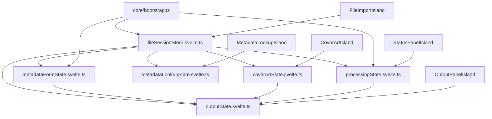

# Finish Frontend De-Hybridization

## Goal

Make this statement fully true across the frontend runtime:

> Operational code is just physical UI behavior, not application truth.

In this pass, “operational” means local, short-lived browser/platform mechanics such as focus management, geometry hit-testing, and temporary drag-state classes. It does **not** mean workflow ownership, business-state storage, or cross-feature coordination.

## Definition Of Done

A good operational item must satisfy all of these:

- it is local to one interaction surface
- it is short-lived and does not outlive the interaction
- it does not own business truth
- removing the DOM element would not erase application state
- other modules do not depend on it as a contract

A bad hybrid seam still has one or more of these traits:

- it stores truth in module globals, singleton controllers, or DOM nodes
- other modules scrape it or call into it as hidden orchestration
- CSS classes, `data-`*, IDs, or imperative helpers act as app-level contracts
- it is required for correctness rather than interaction polish

## Current State Snapshot

The last pass retired the biggest DOM-as-database problems, but the frontend is not yet fully at the stricter standard above.

What is already acceptable operational code:

- focus placement in `src/ui/metadataLookup.ts`
- cover-art drop-zone geometry checks in `src/ui/coverArt.ts`
- temporary drag-hover/dragging classes in `src/ui/fileList/events.ts`
- file-import drop-zone class toggles and geometry checks in `src/ui/fileImport/handlers.ts`

What still violates the target model:

- `src/ui/fileList/state.ts` still owns canonical file, selection, sort, and order-lock truth as module globals
- `src/ui/coverArt.ts` still owns real cover-art truth (`currentCoverArt`, custom/removal intent) outside the reactive store
- `src/ui/metadataLookup.ts` still owns queue/workflow truth as module-global controller state
- `src/ui/statusPanel/logic.ts` still owns processing lifecycle truth through the `StatusPanel` singleton
- `src/ui/outputPanel/dom.ts` still acts as a coordinator/service owner for preview state and preview-race protection
- `src/ui/metadataForm.ts` still exposes a module-global save callback seam through `setMetadataFormSaveHandler()`
- `src/ui/core/appStore.svelte.ts` still mirrors selected indices, pending metadata summary, output draft, and queue summary through `publish`* adapter helpers instead of making consumers read canonical stores directly

## Target Architecture

Design intent:

- canonical runtime truth lives in typed reactive stores/service actions
- components render and dispatch intent
- operational DOM code stays local to the component/adapter that needs it
- no module-global controller or singleton should own cross-feature truth
- no mirror-publisher layer should remain as a second reactive surface for already-canonical state

## Execution Order

1. Canonical file/session store first.
2. Cover-art ownership second.
3. Metadata lookup workflow third.
4. Status singleton replacement fourth.
5. Output derivation cleanup fifth.
6. Operational DOM localization and adapter cleanup sixth.
7. Docs + warning close-out last, while touched seams are still fresh.

This order is deliberate: file/session truth is the upstream dependency for lookup, output, and status behavior.

## Workstream 1: Canonical File/Session Store First

Create one canonical reactive store for loaded files, selection, selection anchor, sort direction, and order lock. This becomes the upstream dependency for the rest of the pass.

Files to change:

- `src/ui/fileList/state.ts`
- `src/ui/fileList/viewState.svelte.ts`
- `src/ui/fileList/actions.ts`
- `src/ui/fileList/dom.ts`
- `src/ui/fileList/events.ts`
- `src/ui/fileImport/FileImportIsland.svelte`

Desired end-state:

- no module-global `currentFileList`, `selectedFileIndex`, or `selectedFileIndices`
- no mirror-style “real state plus reactive state” split
- downstream consumers read canonical reactive state rather than `getCurrentFileList()` snapshots
- event handling uses typed actions over canonical state instead of depending on CSS classes or `data-index` as app-level contracts

Notes:

- temporary drag classes may remain if they stay local and non-authoritative
- if `fileList/events.ts` survives, it should be an interaction adapter, not a hidden state owner

## Workstream 2: Unify Cover-Art Truth And Drop Routing

Move raw cover-art bytes, custom/removal intent, async load state, messages, and drag/drop routing into one reactive store/service boundary.

Files to change:

- `src/ui/coverArt.ts`
- `src/ui/coverArt/state.svelte.ts`
- `src/ui/fileImport/handlers.ts`
- `src/ui/coverArt/CoverArtIsland.svelte`

Desired end-state:

- one store owns bytes plus UI state
- no module-global `currentCoverArt`, `hasCustomCoverArt`, or `coverArtRemovalRequested`
- drag/drop ownership is explicit and local
- geometry checks may remain imperative where required by the platform, but they must not carry business truth

## Workstream 3: Rebuild Metadata Lookup On Typed Workflow State

Replace the module-global lookup queue/controller with a reactive workflow store or small state machine.

Files to change:

- `src/ui/metadataLookup.ts`
- `src/ui/metadataLookup/state.svelte.ts`
- callers in file list, metadata form, cover art, and output preview modules

Desired end-state:

- queue membership, current item, results, apply mode, and cover-art replacement intent live in typed reactive state
- manual focus logic becomes local component behavior rather than `document.getElementById('meta-title')`
- lookup apply actions mutate canonical stores directly instead of orchestrating multiple modules imperatively
- no module-global `lookupQueue` or `queueIndex`

## Workstream 4: Replace The StatusPanel Singleton Completely

Move processing state and actions out of the `StatusPanel` class and into a canonical store/service layer.

Files to change:

- `src/ui/statusPanel/logic.ts`
- `src/ui/statusPanel/viewState.svelte.ts`
- `src/ui/statusPanel/render.ts`
- `src/ui/statusPanel/dom.ts`
- `src/ui/statusPanel/StatusPanelIsland.svelte`
- `src/ui/statusPanel/processing.ts`
- `src/ui/core/bootstrap.ts`
- `src/ui/metadataForm.ts`
- `src/harness/bootstrap.ts`

Desired end-state:

- no `statusPanelInstance`, `getStatusPanel()`, or controller-owned job maps/timers as hidden runtime truth
- processing state, queue state, current status, cancel state, and art thumbnail state live in canonical reactive state
- `StatusPanelIsland.svelte` reads state directly and calls typed actions directly
- `bootstrap.ts` talks to processing actions, not singleton methods
- metadata save triggering does not rely on a module-global callback registration (`setMetadataFormSaveHandler`) between shell/bootstrap/harness and the metadata form surface

## Workstream 5: Make Output State Purely Derived

Finish output derivation after file, metadata, cover-art, and processing ownership are canonicalized.

Files to change:

- `src/ui/outputPanel/dom.ts`
- `src/ui/outputPanel/state.svelte.ts`
- `src/ui/outputPanel/handlers.ts`
- `src/ui/outputPanel/OutputPanelIsland.svelte`
- `src/ui/core/appStore.svelte.ts`
- consumers that currently call `publishOutputDraft()`, `publishQueueMirror()`, `publishSelectedIndices()`, or `publishPendingMetadataSummary()`

Desired end-state:

- preview text, warnings, estimated size, and naming visibility are derived from canonical stores
- async preview RPC race protection moves into a typed store/service action instead of module-local `latestPreviewRequestId`
- `outputPanel/dom.ts` is deleted or renamed to a pure non-DOM helper if any logic remains
- `appStore.svelte.ts` is either deleted or reduced to a clearly scoped derived convenience surface with no publisher-style truth mirroring

## Workstream 6: Localize Operational DOM And Delete Adapter Leftovers

After the canonical ownership shifts are complete, keep only local browser/platform mechanics in runtime DOM helpers.

Likely cleanup targets:

- `src/ui/fileList/events.ts`
- `src/ui/fileImport/handlers.ts`
- `src/ui/statusPanel/dom.ts`
- `src/ui/statusPanel/render.ts`
- any leftover snapshot helpers that only exist for transitional reasons

Acceptance for this workstream:

- no DOM module remains unless it genuinely contains unavoidable DOM/platform integration only
- no CSS class, `data-*`, or element ID acts as an app-level truth contract
- removing a DOM element may remove a visual affordance, but must not erase runtime state

## Documentation Lane

Update docs in the same pass so project guidance matches the new ownership model.

Canonical docs to update:

- `README.md`
- `docs/specs/technical-reference.md`
- `docs/external-apis/README.md`
- `docs/external-apis/tauri-commands.md`
- `docs/external-apis/tauri-ts-boundaries.md`
- any touched feature README that describes runtime ownership

Historical/reference docs to demote or annotate if kept:

- `docs/engineering/fallback-register.md` if it continues to be cited as context rather than current architecture truth
- `docs/engineering/*` notes that still sound current
- delete obsolete `docs/specs/plan_*` trackers instead of preserving low-ROI stale planning docs by default
- feature-local READMEs that present legacy singleton/controller ownership as canonical

Documentation acceptance:

- canonical docs describe current repo truth
- historical docs are clearly marked as historical/reference-only
- no current-facing doc describes module globals or singleton controllers as the intended steady-state architecture

## Verification Lane

Use the repo’s UI proof lane, not just unit tests.

Required verification after each major lane and again at the end:

- `bun run harness:verify --scenario metadata-edit`
- `bun run harness:verify --scenario output-preview`
- `bun run harness:verify --scenario status-processing`
- extend `src/harness/scenarios.ts` if `--changed` reveals uncovered UI behavior
- `scripts/checks.sh standard`

Add or update tests around:

- canonical file selection/reorder ownership
- cover-art routing and custom/removal intent
- lookup queue/apply workflow through canonical stores
- processing lifecycle without singleton access
- output derivation from canonical stores
- remaining operational DOM helpers staying local and non-authoritative

## `noExplicitAny` Warning Debt

Current facts:

- `package.json` runs `bunx @biomejs/biome check ...` inside `fmt:check`, so lint warnings surface during the standard gate
- `biome.json` configures `noExplicitAny` as `warn`
- the active warning surface is still concentrated in tests, not live runtime code
- the dominant cluster is the `statusPanel` test suite, which is likely to change anyway when singleton/controller ownership is removed

Recommendation:

- do not front-load a repo-wide `noExplicitAny` cleanup before ownership work
- do remove explicit `any` from touched test suites during this pass
- add a guardrail so warning debt cannot grow again
- if warning cleanup must be split, land the guardrail in the same overall effort so the repo cannot drift while the follow-on test typing pass is queued

## Acceptance Criteria

- file, selection, ordering, cover-art, lookup, processing, and output truth live in canonical reactive state/store-owned actions
- operational DOM code is local, short-lived, and non-authoritative
- no feature workflow depends on module-global controllers, singleton accessors, module-global callback registration, DOM IDs, CSS classes, `data-*` attributes, or publisher-mirror helpers as hidden runtime contracts
- removing a DOM element does not erase business truth
- canonical docs match repo reality and historical docs are clearly demoted
- `scripts/checks.sh standard` and required harness verification stay green
