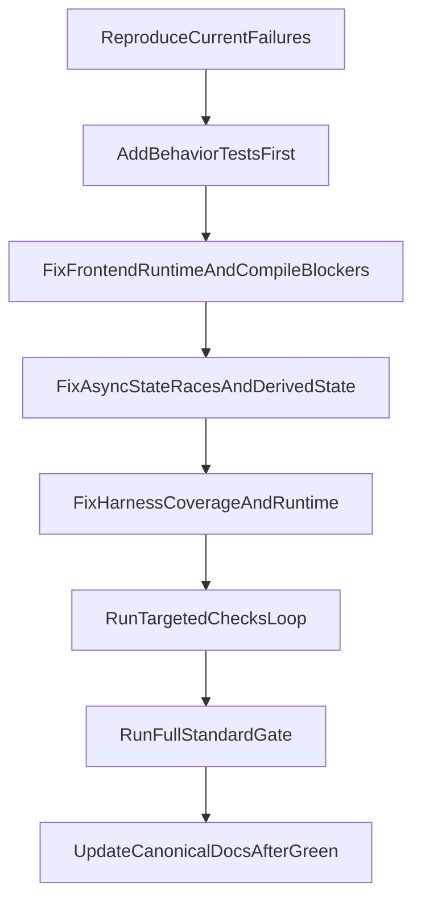

# Verification Repair And Behavior-Test Plan

## Goal

Restore the branch to a trustworthy, green verification state while preserving the de-hybridization direction. The work is not done until:

- frontend tests/build pass,
- required harness verification passes,
- `scripts/checks.sh standard` passes,
- new tests validate user-visible behavior and race safety rather than internal implementation details,
- only then do we update canonical docs to reflect the new steady state.

## Execution Order

## Lane 1: Restore Frontend Runtime And Compile Health

Target files:

- [src/ui/fileList/state.ts](/Users/jstar/Projects/audiobook-boss/src/ui/fileList/state.ts)
- likely new [src/ui/fileList/state.svelte.ts](/Users/jstar/Projects/audiobook-boss/src/ui/fileList/state.svelte.ts)
- [src/ui/fileList/actions.ts](/Users/jstar/Projects/audiobook-boss/src/ui/fileList/actions.ts)
- [src/HarnessApp.svelte](/Users/jstar/Projects/audiobook-boss/src/HarnessApp.svelte)
- [src/ui/coverArt/CoverArtIsland.svelte](/Users/jstar/Projects/audiobook-boss/src/ui/coverArt/CoverArtIsland.svelte)

Plan:

- Move the rune-backed file-list session state into a proper `.svelte.ts` store module and leave a thin compatibility shim at `fileList/state.ts` if needed so import churn stays low.
- Remove the stale `getSelectedFileIndices` import from `fileList/actions.ts`.
- Wire `HarnessApp.svelte` to the real cover-art callbacks, mirroring [src/App.svelte](/Users/jstar/Projects/audiobook-boss/src/App.svelte), so the harness exercises the same surface as production instead of weakening props.

Behavior-first test work before or alongside fixes:

- Extend [src/harness/HarnessApp.test.ts](/Users/jstar/Projects/audiobook-boss/src/harness/HarnessApp.test.ts) to assert the harness page mounts the real cover-art controls and that invoking the save/cover-art actions uses the production wiring shape.
- Add one DOM-level file-list behavior test that proves reorder preserves the logical selected file and updates visible inspector context, not just internal indices.

## Lane 2: Fix The High-Risk State And Race Regressions

Target files:

- [src/ui/fileList/metadataPanel.ts](/Users/jstar/Projects/audiobook-boss/src/ui/fileList/metadataPanel.ts)
- [src/ui/encoderPanel/logic.ts](/Users/jstar/Projects/audiobook-boss/src/ui/encoderPanel/logic.ts)
- [src/ui/outputPanel/dom.ts](/Users/jstar/Projects/audiobook-boss/src/ui/outputPanel/dom.ts)
- [src/ui/outputPanel/state.svelte.ts](/Users/jstar/Projects/audiobook-boss/src/ui/outputPanel/state.svelte.ts)

Plan:

- Guard single-selection metadata loads with a latest-request or selected-file-path check so stale async metadata cannot populate the form for the wrong file.
- Guard `autoUpdateCoverArtFromFirstValidFile()` so late embedded-art reads cannot overwrite newer custom cover-art state or a newer file-list generation.
- Make estimated-size updates react to encoder/sample-rate changes again, preferably by deriving from canonical state or, at minimum, by triggering recomputation whenever encoder state syncs into output state.

Behavior-first tests to add:

- New focused race test file, likely [src/ui/**tests**/metadataPanel-race.test.ts](/Users/jstar/Projects/audiobook-boss/src/ui/__tests__/metadataPanel-race.test.ts), covering:
  - select A then B, resolve A late, final form/preview still belongs to B;
  - stale selection load does not later save A-like metadata onto B.
- New cover-art race test covering:
  - in-flight auto-cover load does not overwrite custom art chosen after the request starts;
  - old file-list auto-cover result does not win after the file list changes.
- Extend [src/ui/**tests**/encoderPanel-behavior.test.ts](/Users/jstar/Projects/audiobook-boss/src/ui/__tests__/encoderPanel-behavior.test.ts) so bitrate/channel changes visibly update the rendered estimated-size text without calling output helpers directly.

## Lane 3: Close ControlPlane Harness Gaps

Target files:

- [src/harness/scenarios.ts](/Users/jstar/Projects/audiobook-boss/src/harness/scenarios.ts)
- [src/harness/mockTauri.ts](/Users/jstar/Projects/audiobook-boss/src/harness/mockTauri.ts)
- [src/harness/runtime.ts](/Users/jstar/Projects/audiobook-boss/src/harness/runtime.ts)
- changed UI surfaces under [src/ui/fileImport](/Users/jstar/Projects/audiobook-boss/src/ui/fileImport) and [src/ui/fileList](/Users/jstar/Projects/audiobook-boss/src/ui/fileList)

Plan:

- Add explicit scenario mapping for the changed file-import and file-list ownership surfaces so `harness:verify --changed` stops failing at the coverage gate.
- Add a dedicated file-management scenario, or extend existing mappings if clearly cleaner, to cover the Input and File Order surface.
- Fix the harness runtime/setup issues that are currently making named scenarios unreliable:
  - `status-processing` likely needs mock queue progress for all queued jobs, not just the first one;
  - `metadata-edit` likely needs bootstrap readiness to wait until seeded file selection exists before scenario actions begin.

Behavior the harness should verify:

- file import populates the list,
- selection updates inspector/context truthfully,
- reorder/remove/clear keep selection and inspector state coherent,
- order-lock disables mutating controls during processing,
- metadata-edit still works from the current selection,
- output preview remains healthy after selection/state changes.

## Lane 4: Verification Loop

For each bug class, use a test-first loop:

1. Add or adjust the smallest failing behavior test or harness assertion that proves the user-facing issue.
2. Implement the fix.
3. Re-run only the targeted test(s) and relevant harness scenario until green.
4. Move to the next bug class.

Required targeted loop before full completion claim:

- `bun run test -- src/harness/HarnessApp.test.ts`
- targeted Vitest files for each changed behavior area
- `bun run build`
- `bun run harness:verify --scenario metadata-edit`
- `bun run harness:verify --scenario output-preview`
- `bun run harness:verify --scenario status-processing`
- new file-management scenario once added
- `bun run harness:verify --changed`

Final required gate:

- `scripts/checks.sh standard`

Verification acceptance:

- no compile/runtime/rune failures,
- no harness coverage gaps for changed UI paths,
- no hanging/timing-out required scenarios,
- tests assert behavior through visible UI/store outcomes rather than direct helper invocation alone.

## Lane 5: Docs Only After Green

Only after the full loop above is green, update canonical docs to match the new repo reality.

Primary docs to update after code is stable:

- [README.md](/Users/jstar/Projects/audiobook-boss/README.md)
- [docs/specs/technical-reference.md](/Users/jstar/Projects/audiobook-boss/docs/specs/technical-reference.md)
- [docs/verification.md](/Users/jstar/Projects/audiobook-boss/docs/verification.md)
- [docs/browser-harness.md](/Users/jstar/Projects/audiobook-boss/docs/browser-harness.md)
- any touched feature docs for `fileList`, `statusPanel`, `outputPanel`, or harness ownership

Doc scope:

- describe the actual steady-state ownership model after the fixes,
- record the new harness scenario coverage if the scenario set changes,
- avoid documenting in-progress or partially migrated architecture as finished truth.

## High-ROI Test Philosophy

Keep the added tests accretive and behavior-oriented:

- prefer selection/reorder/save/lock/preview outcomes over assertions on internal `Set` or request-id mechanics,
- prefer harness or DOM-visible behavior when the bug crosses module boundaries,
- only unit-test internals when they protect a non-trivial invariant that the higher-level tests would not isolate well,
- do not add “existence tests” that simply instantiate modules without proving a user-relevant contract.
