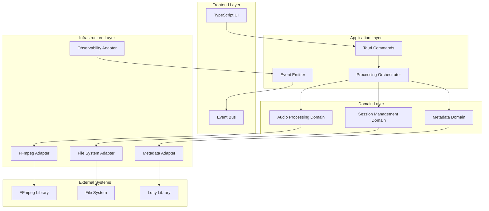

# Design Document

## Overview

This design document outlines a comprehensive re-architecture of the Audiobook Boss application from an L6 Distinguished Software Engineer perspective. The new architecture addresses critical reliability, performance, and maintainability issues while establishing patterns for long-term scalability.

The design follows Domain-Driven Design principles with clear bounded contexts, implements the Hexagonal Architecture pattern for testability, and incorporates modern observability and resilience patterns.

## Architecture

### High-Level Architecture



### Bounded Contexts

#### 1. Audio Processing Context
- **Responsibility**: Audio file validation, encoding, streaming, and format conversion
- **Key Entities**: AudioFile, ProcessingPipeline, StreamProcessor, EncodingSettings
- **Interfaces**: AudioProcessor, StreamingEngine, QualityValidator

#### 2. Metadata Management Context
- **Responsibility**: Metadata extraction, validation, embedding, and format conversion
- **Key Entities**: AudiobookMetadata, CoverArt, MetadataSchema, EmbeddingStrategy
- **Interfaces**: MetadataProcessor, EmbeddingEngine, ValidationEngine

#### 3. Session Management Context
- **Responsibility**: Processing lifecycle, state management, cancellation, and cleanup
- **Key Entities**: ProcessingSession, SessionState, CleanupPolicy, CancellationToken
- **Interfaces**: SessionManager, StateTracker, CleanupOrchestrator

#### 4. Observability Context
- **Responsibility**: Logging, metrics, tracing, error tracking, and performance monitoring
- **Key Entities**: ProcessingMetrics, ErrorContext, TraceSpan, PerformanceCounter
- **Interfaces**: MetricsCollector, ErrorReporter, TraceEmitter

## Components and Interfaces

### Core Processing Engine

```rust
// Domain Service - Audio Processing
pub trait AudioProcessor {
    async fn process_stream(
        &self,
        input: AudioStream,
        settings: EncodingSettings,
        progress: ProgressReporter,
    ) -> Result<AudioStream>;
    
    async fn validate_input(&self, file: &AudioFile) -> ValidationResult;
    fn estimate_processing_time(&self, files: &[AudioFile]) -> Duration;
}

// Domain Service - Metadata Management
pub trait MetadataProcessor {
    async fn extract_metadata(&self, file: &AudioFile) -> Result<AudiobookMetadata>;
    async fn embed_metadata(
        &self,
        target: &mut AudioStream,
        metadata: &AudiobookMetadata,
    ) -> Result<()>;
    fn validate_compatibility(&self, metadata: &AudiobookMetadata) -> ValidationResult;
}

// Domain Service - Session Management
pub trait SessionManager {
    fn create_session(&self, config: SessionConfig) -> ProcessingSession;
    async fn execute_with_session<T>(
        &self,
        session: &ProcessingSession,
        operation: impl Future<Output = Result<T>>,
    ) -> Result<T>;
    fn cancel_session(&self, session_id: &SessionId) -> Result<()>;
}
```

### Streaming Architecture

```rust
// Core streaming abstraction
pub struct AudioStream {
    source: Box<dyn StreamSource>,
    format: AudioFormat,
    metadata: StreamMetadata,
}

pub trait StreamSource: Send + Sync {
    async fn read_chunk(&mut self, buffer: &mut [u8]) -> Result<usize>;
    fn seek(&mut self, position: Duration) -> Result<()>;
    fn duration(&self) -> Option<Duration>;
}

// Streaming processor with backpressure
pub struct StreamingProcessor {
    input_buffer: RingBuffer<AudioChunk>,
    output_buffer: RingBuffer<AudioChunk>,
    encoder: Box<dyn StreamingEncoder>,
    backpressure_threshold: usize,
}

impl StreamingProcessor {
    pub async fn process_with_backpressure(
        &mut self,
        input: AudioStream,
        progress: ProgressReporter,
    ) -> Result<AudioStream> {
        let mut input_reader = input.into_reader();
        let mut output_writer = self.create_output_writer();
        
        while let Some(chunk) = input_reader.read_chunk().await? {
            // Implement backpressure
            if self.output_buffer.len() > self.backpressure_threshold {
                self.wait_for_buffer_space().await?;
            }
            
            let encoded_chunk = self.encoder.encode_chunk(chunk).await?;
            self.output_buffer.push(encoded_chunk);
            
            progress.report_chunk_processed(chunk.duration());
        }
        
        Ok(output_writer.finalize().await?)
    }
}
```

### Error Handling and Resilience

```rust
// Circuit breaker for FFmpeg operations
pub struct FFmpegCircuitBreaker {
    state: CircuitState,
    failure_threshold: usize,
    recovery_timeout: Duration,
    failure_count: AtomicUsize,
    last_failure: AtomicU64,
}

impl FFmpegCircuitBreaker {
    pub async fn execute<T>(
        &self,
        operation: impl Future<Output = Result<T>>,
    ) -> Result<T> {
        match self.state {
            CircuitState::Closed => {
                match operation.await {
                    Ok(result) => {
                        self.reset_failure_count();
                        Ok(result)
                    }
                    Err(e) => {
                        self.record_failure();
                        if self.should_open_circuit() {
                            self.open_circuit();
                        }
                        Err(e)
                    }
                }
            }
            CircuitState::Open => {
                if self.should_attempt_recovery() {
                    self.half_open_circuit();
                    self.execute(operation).await
                } else {
                    Err(AppError::CircuitBreakerOpen)
                }
            }
            CircuitState::HalfOpen => {
                match operation.await {
                    Ok(result) => {
                        self.close_circuit();
                        Ok(result)
                    }
                    Err(e) => {
                        self.open_circuit();
                        Err(e)
                    }
                }
            }
        }
    }
}

// Retry policy with exponential backoff
pub struct RetryPolicy {
    max_attempts: usize,
    base_delay: Duration,
    max_delay: Duration,
    backoff_multiplier: f64,
}

impl RetryPolicy {
    pub async fn execute_with_retry<T>(
        &self,
        mut operation: impl FnMut() -> Pin<Box<dyn Future<Output = Result<T>>>>,
    ) -> Result<T> {
        let mut attempt = 0;
        let mut delay = self.base_delay;
        
        loop {
            attempt += 1;
            
            match operation().await {
                Ok(result) => return Ok(result),
                Err(e) if attempt >= self.max_attempts => return Err(e),
                Err(e) if !self.is_retryable(&e) => return Err(e),
                Err(_) => {
                    tokio::time::sleep(delay).await;
                    delay = (delay * self.backoff_multiplier as u32)
                        .min(self.max_delay);
                }
            }
        }
    }
}
```

### Observability Infrastructure

```rust
// Structured logging with correlation
pub struct CorrelatedLogger {
    base_logger: Logger,
    correlation_id: CorrelationId,
    session_id: SessionId,
}

impl CorrelatedLogger {
    pub fn info(&self, message: &str, context: LogContext) {
        self.base_logger.info(
            message,
            context
                .with_correlation_id(self.correlation_id)
                .with_session_id(self.session_id)
        );
    }
    
    pub fn error(&self, error: &AppError, context: LogContext) {
        self.base_logger.error(
            &error.to_string(),
            context
                .with_correlation_id(self.correlation_id)
                .with_session_id(self.session_id)
                .with_error_details(error)
        );
    }
}

// Metrics collection
pub struct ProcessingMetrics {
    processing_duration: Histogram,
    file_size_processed: Counter,
    error_count: Counter,
    memory_usage: Gauge,
    active_sessions: Gauge,
}

impl ProcessingMetrics {
    pub fn record_processing_start(&self, session_id: &SessionId) {
        self.active_sessions.increment();
        self.processing_duration.start_timer(session_id);
    }
    
    pub fn record_processing_complete(
        &self,
        session_id: &SessionId,
        file_size: u64,
        duration: Duration,
    ) {
        self.active_sessions.decrement();
        self.processing_duration.record(duration);
        self.file_size_processed.increment_by(file_size);
    }
    
    pub fn record_error(&self, error: &AppError, context: ErrorContext) {
        self.error_count.increment();
        // Emit structured error event for monitoring
        self.emit_error_event(error, context);
    }
}
```

## Data Models

### Core Domain Models

```rust
// Audio Processing Domain
#[derive(Debug, Clone)]
pub struct AudioFile {
    pub path: PathBuf,
    pub metadata: FileMetadata,
    pub validation_status: ValidationStatus,
    pub processing_hints: ProcessingHints,
}

#[derive(Debug, Clone)]
pub struct ProcessingPipeline {
    pub stages: Vec<ProcessingStage>,
    pub configuration: PipelineConfiguration,
    pub quality_settings: QualitySettings,
}

#[derive(Debug, Clone)]
pub struct EncodingSettings {
    pub codec: AudioCodec,
    pub bitrate: Bitrate,
    pub sample_rate: SampleRate,
    pub channels: ChannelConfiguration,
    pub quality_profile: QualityProfile,
}

// Metadata Domain
#[derive(Debug, Clone)]
pub struct AudiobookMetadata {
    pub core_metadata: CoreMetadata,
    pub extended_metadata: ExtendedMetadata,
    pub cover_art: Option<CoverArt>,
    pub chapters: Vec<Chapter>,
}

#[derive(Debug, Clone)]
pub struct CoverArt {
    pub data: Vec<u8>,
    pub format: ImageFormat,
    pub dimensions: ImageDimensions,
    pub embedding_strategy: EmbeddingStrategy,
}

// Session Management Domain
#[derive(Debug)]
pub struct ProcessingSession {
    pub id: SessionId,
    pub state: SessionState,
    pub configuration: SessionConfiguration,
    pub resources: SessionResources,
    pub cancellation_token: CancellationToken,
}

#[derive(Debug, Clone)]
pub struct SessionState {
    pub phase: ProcessingPhase,
    pub progress: ProgressState,
    pub errors: Vec<ProcessingError>,
    pub warnings: Vec<ProcessingWarning>,
}
```

### Value Objects and Enums

```rust
#[derive(Debug, Clone, Copy, PartialEq, Eq)]
pub enum ProcessingPhase {
    Initializing,
    Validating,
    Analyzing,
    Processing,
    Embedding,
    Finalizing,
    Completed,
    Failed,
    Cancelled,
}

#[derive(Debug, Clone, Copy, PartialEq, Eq)]
pub enum QualityProfile {
    Draft,      // Fast processing, lower quality
    Standard,   // Balanced quality and speed
    High,       // High quality, slower processing
    Archival,   // Maximum quality, slowest processing
}

#[derive(Debug, Clone, Copy, PartialEq, Eq)]
pub enum EmbeddingStrategy {
    Native,     // Embed during encoding
    PostProcess, // Embed after encoding
    Hybrid,     // Try native, fallback to post-process
}
```

## Error Handling

### Error Hierarchy

```rust
#[derive(Error, Debug)]
pub enum AppError {
    // Domain Errors
    #[error("Audio processing failed: {context}")]
    AudioProcessing { 
        context: String, 
        source: Box<dyn std::error::Error + Send + Sync> 
    },
    
    #[error("Metadata operation failed: {operation}")]
    MetadataOperation { 
        operation: String, 
        source: Box<dyn std::error::Error + Send + Sync> 
    },
    
    #[error("Session management error: {details}")]
    SessionManagement { details: String },
    
    // Infrastructure Errors
    #[error("FFmpeg operation failed: {command}")]
    FFmpegFailure { 
        command: String, 
        exit_code: Option<i32>,
        stderr: String 
    },
    
    #[error("File system operation failed: {operation} on {path}")]
    FileSystemError { 
        operation: String, 
        path: PathBuf,
        source: std::io::Error 
    },
    
    // System Errors
    #[error("Resource exhaustion: {resource}")]
    ResourceExhaustion { resource: String },
    
    #[error("Circuit breaker is open for {service}")]
    CircuitBreakerOpen { service: String },
    
    #[error("Operation cancelled by user")]
    OperationCancelled,
    
    #[error("Validation failed: {details}")]
    ValidationFailure { details: String },
}

// Error context for rich error information
#[derive(Debug, Clone)]
pub struct ErrorContext {
    pub session_id: Option<SessionId>,
    pub correlation_id: Option<CorrelationId>,
    pub operation: String,
    pub file_path: Option<PathBuf>,
    pub timestamp: SystemTime,
    pub system_info: SystemInfo,
}
```

### Error Recovery Strategies

```rust
pub trait ErrorRecoveryStrategy {
    fn can_recover(&self, error: &AppError) -> bool;
    async fn attempt_recovery(&self, error: &AppError, context: &ErrorContext) -> Result<()>;
}

pub struct FileSystemRecoveryStrategy;

impl ErrorRecoveryStrategy for FileSystemRecoveryStrategy {
    fn can_recover(&self, error: &AppError) -> bool {
        matches!(error, AppError::FileSystemError { .. })
    }
    
    async fn attempt_recovery(&self, error: &AppError, context: &ErrorContext) -> Result<()> {
        match error {
            AppError::FileSystemError { operation, path, .. } => {
                match operation.as_str() {
                    "create_temp_dir" => self.retry_temp_dir_creation().await,
                    "write_file" => self.retry_file_write(path).await,
                    _ => Err(AppError::ValidationFailure { 
                        details: "No recovery strategy available".to_string() 
                    }),
                }
            }
            _ => Err(AppError::ValidationFailure { 
                details: "Error type not supported by this strategy".to_string() 
            }),
        }
    }
}
```

## Testing Strategy

### Testing Architecture

```rust
// Test doubles for external dependencies
pub struct MockFFmpegAdapter {
    responses: HashMap<String, Result<ProcessingResult>>,
    call_count: AtomicUsize,
}

impl AudioProcessor for MockFFmpegAdapter {
    async fn process_stream(
        &self,
        input: AudioStream,
        settings: EncodingSettings,
        progress: ProgressReporter,
    ) -> Result<AudioStream> {
        self.call_count.fetch_add(1, Ordering::SeqCst);
        
        let key = format!("{:?}_{:?}", input.format, settings);
        self.responses
            .get(&key)
            .cloned()
            .unwrap_or_else(|| Ok(self.create_default_output()))
    }
}

// Integration test framework
pub struct IntegrationTestHarness {
    temp_dir: TempDir,
    test_files: Vec<PathBuf>,
    mock_adapters: HashMap<String, Box<dyn Any>>,
}

impl IntegrationTestHarness {
    pub fn new() -> Self {
        Self {
            temp_dir: TempDir::new().unwrap(),
            test_files: Vec::new(),
            mock_adapters: HashMap::new(),
        }
    }
    
    pub fn with_test_audio_file(&mut self, duration: Duration, format: AudioFormat) -> &mut Self {
        let file_path = self.create_test_audio_file(duration, format);
        self.test_files.push(file_path);
        self
    }
    
    pub fn with_mock_adapter<T: 'static>(&mut self, name: &str, adapter: T) -> &mut Self {
        self.mock_adapters.insert(name.to_string(), Box::new(adapter));
        self
    }
    
    pub async fn run_processing_test(&self) -> ProcessingResult {
        // Set up test environment with mocks
        // Execute processing pipeline
        // Verify results and side effects
        todo!()
    }
}
```

### Test Categories

1. **Unit Tests**: Individual components in isolation
2. **Integration Tests**: Component interactions with real dependencies
3. **Contract Tests**: Interface compliance verification
4. **Performance Tests**: Throughput and latency validation
5. **Chaos Tests**: Failure scenario validation
6. **Property Tests**: Invariant verification across input ranges

## Performance Considerations

### Streaming and Memory Management

```rust
// Memory-efficient streaming with bounded buffers
pub struct BoundedStreamProcessor {
    input_buffer: BoundedBuffer<AudioChunk>,
    output_buffer: BoundedBuffer<AudioChunk>,
    memory_limit: usize,
    current_memory_usage: AtomicUsize,
}

impl BoundedStreamProcessor {
    pub async fn process_with_memory_limit(
        &mut self,
        input: AudioStream,
        memory_limit: usize,
    ) -> Result<AudioStream> {
        self.memory_limit = memory_limit;
        
        let processor = StreamingProcessor::new()
            .with_memory_monitor(self.create_memory_monitor())
            .with_backpressure_handler(self.create_backpressure_handler());
            
        processor.process_stream(input).await
    }
    
    fn create_memory_monitor(&self) -> MemoryMonitor {
        MemoryMonitor::new(self.memory_limit)
            .with_callback(|usage| {
                if usage > self.memory_limit * 90 / 100 {
                    // Trigger garbage collection or buffer flush
                    self.trigger_memory_cleanup();
                }
            })
    }
}

// Parallel processing with work stealing
pub struct ParallelProcessor {
    worker_pool: WorkerPool,
    task_queue: WorkStealingQueue<ProcessingTask>,
    coordination: Arc<ProcessingCoordination>,
}

impl ParallelProcessor {
    pub async fn process_files_parallel(
        &self,
        files: Vec<AudioFile>,
        settings: EncodingSettings,
    ) -> Result<Vec<ProcessingResult>> {
        let tasks: Vec<ProcessingTask> = files
            .into_iter()
            .map(|file| ProcessingTask::new(file, settings.clone()))
            .collect();
            
        let results = self.worker_pool
            .execute_tasks(tasks)
            .await?;
            
        Ok(results)
    }
}
```

### Performance Monitoring

```rust
pub struct PerformanceProfiler {
    metrics: ProcessingMetrics,
    profiling_enabled: bool,
    sample_rate: f64,
}

impl PerformanceProfiler {
    pub fn profile_operation<T>(
        &self,
        operation_name: &str,
        operation: impl FnOnce() -> T,
    ) -> T {
        if !self.should_profile() {
            return operation();
        }
        
        let start = Instant::now();
        let result = operation();
        let duration = start.elapsed();
        
        self.metrics.record_operation_duration(operation_name, duration);
        result
    }
    
    pub async fn profile_async_operation<T>(
        &self,
        operation_name: &str,
        operation: impl Future<Output = T>,
    ) -> T {
        if !self.should_profile() {
            return operation.await;
        }
        
        let start = Instant::now();
        let result = operation.await;
        let duration = start.elapsed();
        
        self.metrics.record_operation_duration(operation_name, duration);
        result
    }
}
```

## Security Considerations

### Input Validation and Sanitization

```rust
pub struct InputValidator {
    file_size_limit: u64,
    allowed_formats: HashSet<AudioFormat>,
    metadata_sanitizer: MetadataSanitizer,
}

impl InputValidator {
    pub fn validate_audio_file(&self, file: &AudioFile) -> ValidationResult {
        let mut issues = Vec::new();
        
        // File size validation
        if file.size() > self.file_size_limit {
            issues.push(ValidationIssue::FileSizeExceeded {
                actual: file.size(),
                limit: self.file_size_limit,
            });
        }
        
        // Format validation
        if !self.allowed_formats.contains(&file.format()) {
            issues.push(ValidationIssue::UnsupportedFormat {
                format: file.format(),
            });
        }
        
        // Path traversal protection
        if self.contains_path_traversal(&file.path) {
            issues.push(ValidationIssue::PathTraversalAttempt {
                path: file.path.clone(),
            });
        }
        
        ValidationResult::new(issues)
    }
    
    pub fn sanitize_metadata(&self, metadata: &mut AudiobookMetadata) -> SanitizationResult {
        self.metadata_sanitizer.sanitize(metadata)
    }
}

// Sandboxing for FFmpeg operations
pub struct SandboxedFFmpegExecutor {
    sandbox_config: SandboxConfig,
    resource_limits: ResourceLimits,
}

impl SandboxedFFmpegExecutor {
    pub async fn execute_sandboxed(
        &self,
        command: FFmpegCommand,
    ) -> Result<ProcessingResult> {
        let sandbox = Sandbox::new(self.sandbox_config.clone())
            .with_resource_limits(self.resource_limits.clone())
            .with_network_isolation()
            .with_filesystem_restrictions();
            
        sandbox.execute(command).await
    }
}
```

This design provides a robust, scalable, and maintainable architecture that addresses all the requirements while establishing patterns for future growth and evolution.