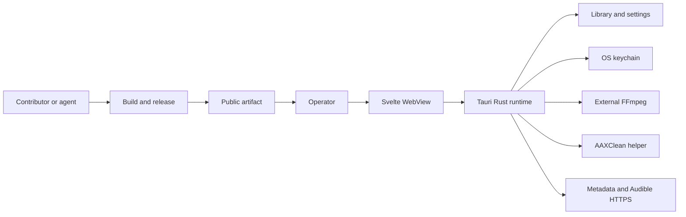

# Audiobook Boss Threat Model

**Assessment date:** 2026-08-07  
**Evidence snapshot:** branch `fix/endgame-residual-gates`, commit `eff68eb9`  
**Scope:** entire repository on disk, separated into runtime, build/release, developer/agent, reference-source, and static-site surfaces  
**Status:** assessment complete; remediation not implemented; no critical threat identified; three high-priority and five medium-priority threats remain

## Executive summary

Audiobook Boss is a local, single-user Tauri desktop app with no unauthenticated network listener. Under the confirmed posture—public binary distribution, contributor-controlled branches may reach normal agent sessions, and credentials plus library confidentiality, integrity, and availability all matter—the release and development supply chain is the dominant risk. Public releases should be blocked on artifact signing/provenance, deterministic FFmpeg and AAXClean inputs, and a complete dependency-audit gate (TM-001, TM-003, TM-008). Contributor-controlled branches should not run with the current full-filesystem, no-approval, network-enabled agent profile (TM-002). Runtime hardening remains important but lower priority: bound hostile media and local-file allocations, reduce WebView-to-IPC blast radius, make external-executable trust explicit, and constrain remote downloads.

## Scope and assumptions

### In scope

- Application runtime: `src/`, `src-tauri/`, `crates/`, the bundled AAXClean helper, FFmpeg integration, Tauri IPC, settings, filesystem operations, metadata, and Audible workflows.
- Build and distribution: `Cargo.toml`, lockfiles, `vendor/`, `tools/`, `scripts/`, `.github/workflows/`, Tauri bundle configuration, and release guidance.
- Developer and agent surfaces: `AGENTS.md`, `.agents/`, repository-local scripts, and contributor-controlled changes that a privileged coding agent may inspect or execute.
- Static publishing: `site/` and the GitHub Pages workflow.
- `repos/`: assessed as a developer/agent context and supply-chain surface. Its squashed upstream trees are not compiled into the application by default (`repos/AGENTS.md`).
- The ignored AAXClean sidecar currently present under `src-tauri/binaries/`: assessed because the build configuration packages that path (`src-tauri/tauri.conf.json` → `bundle.externalBin`).
- Tests, examples, dependency directories, and generated/build caches: assessed for their ability to affect agents, builds, or packaged output; manifests, lockfiles, advisory results, and security-relevant on-disk artifacts were used instead of treating derived files as independent source.

### Out of scope

- A complete security audit of Audible, Audnexus, Open Library, GitHub, Apple Keychain, FFmpeg, AAXClean, Tauri, or other upstream projects.
- An attacker who already controls the operator's OS account as the primary win condition. Same-user file substitution is considered only where ABB turns it into a durable or deceptively trusted execution path.
- DRM legality, content licensing, and encoder-quality policy.
- Penetration testing, fuzzing, signing-account review, and GitHub organization settings that are not represented on disk.

### Validated assumptions

- Public users may download ABB release artifacts; release integrity is therefore a product-security boundary.
- Coding agents may inspect or execute contributor-controlled branches on this Mac with normal credentials available.
- Audible credentials, audiobook content, metadata, filenames, and local paths are sensitive; output integrity and application/host availability also matter.
- ABB runs as the logged-in user and is not intended to provide isolation from that user.
- The packaged app loads local frontend assets. Network access is outbound to metadata and Audible services; there is no application server or multi-tenant authorization layer (`src-tauri/tauri.conf.json`, `src-tauri/src/lib.rs`).

### Open questions that would change ranking

- GitHub branch protection, environment protection, release-token scope, and required-review settings were not observable from the repository. Strong external controls would reduce TM-001 and TM-002 likelihood.
- The supported public platform set is unclear. The current sidecar and local release path are macOS arm64-specific, while some keychain and executable-validation behavior is platform-dependent.

## System model

### Primary components

| Component | Security role | Evidence anchor |
| --- | --- | --- |
| Svelte WebView | Collects operator intent and renders local application state | `src/main.ts`, `src/ui/` |
| Tauri IPC boundary | Exposes typed frontend-to-Rust commands and events | `src/lib/tauri/`, `src-tauri/src/ipc_contract.rs` |
| Rust runtime | Owns validation, workflows, errors, and application state | `src-tauri/src/lib.rs`, `src-tauri/src/commands/` |
| Filesystem and output owners | Read media and images; stage, commit, replace, and clean outputs | `src-tauri/src/audio/path_validation.rs`, `src-tauri/src/output_artifact/`, `src-tauri/src/remote_source/staging.rs` |
| Metadata and media parsers | Decode images, inspect media, and read/write MP4 tags | `src-tauri/src/commands/metadata.rs`, `src-tauri/src/metadata/`, `docs/unsafe-code-register.md` |
| Remote-source runtime | Performs Audible authentication, library access, downloads, and materialization | `src-tauri/src/remote_source/` |
| OS keychain | Stores long-lived Audible authentication state | `src-tauri/src/remote_source/vault.rs`, `docs/DECISIONS.md` |
| External executables | User-selected FFmpeg and bundled AAXClean process media with user privileges | `src-tauri/src/audio/toolchain/`, `src-tauri/src/remote_source/materializer/` |
| Build and release path | Resolves dependencies, builds helpers and FFmpeg, packages the app, and publishes artifacts | `scripts/build-app.ts`, `scripts/publish-aaxclean-helper.ts`, `vendor/ffmpeg-sys-next-8.1.0/build.rs`, `.github/workflows/` |
| Agent and reference context | Guides privileged automation and supplies upstream research snapshots | `.agents/config.toml`, `AGENTS.md`, `repos/AGENTS.md` |

### Data flows and trust boundaries

- **Operator → WebView:** file and directory selections, metadata edits, cover sources, settings, and Audible-auth handoff input cross the GUI/OS-dialog boundary. Rust revalidates durable paths and metadata intent; UI validation is not authoritative (`src-tauri/src/audio/path_validation.rs`, `src-tauri/src/commands/metadata.rs`).
- **WebView → Rust runtime:** typed JSON IPC commands, events, job IDs, paths, and byte arrays cross Tauri IPC. Capabilities omit shell, filesystem, and HTTP plugins, but registered custom commands execute with the user's authority. The packaged WebView has no configured CSP and exposes the global Tauri object (`src-tauri/capabilities/default.json`, `src-tauri/tauri.conf.json`).
- **Rust runtime → Filesystem:** media, images, settings, partial downloads, and final outputs cross local filesystem APIs. Input validation rejects symlinks and non-regular files; output and staging owners canonicalize roots, review collisions, and use staged commits (`src-tauri/src/audio/path_validation.rs`, `src-tauri/src/output_artifact/`, `src-tauri/src/remote_source/staging.rs`).
- **Rust runtime → Internet:** lookup terms, public metadata, cover URLs, Audible requests, and content downloads cross HTTPS. Cover fetching uses a bogon-filtering resolver, HTTPS-only redirect validation, a 30-second timeout, a 10 MiB byte cap, content-type checks, and image-dimension limits. Audible audio downloads enforce HTTPS and redirect count but not a public-IP policy, total byte budget, or client timeout (`src-tauri/src/commands/metadata.rs`, `src-tauri/src/remote_source/providers/audible/http/client.rs`, `src-tauri/src/remote_source/providers/audible/audio_download.rs`).
- **Rust runtime → OS keychain:** long-lived Audible auth state crosses the platform keyring API and does not enter generated frontend types. The current unsigned macOS build intentionally uses the legacy file keychain pending a signed-entitlement migration (`src-tauri/src/remote_source/vault.rs`, `docs/DECISIONS.md`).
- **Rust runtime → External executables:** paths and media arguments cross direct process APIs; AAXClean additionally receives decryption material in JSON over stdin. Arguments are not shell-concatenated. Executable identity and provenance are not verified at spawn (`src-tauri/src/audio/processor/external_fdk/`, `src-tauri/src/remote_source/materializer/mod.rs`).
- **Contributor or agent → Build/release → Public user:** source, instructions, lockfiles, helper output, fetched FFmpeg source, workflow configuration, and credentials influence the shipped app. Lockfiles and some CI controls exist, but the helper freshness check is timestamp-based and bundled FFmpeg fetches a mutable release branch (`scripts/publish-aaxclean-helper.ts`, `vendor/ffmpeg-sys-next-8.1.0/build.rs`).

#### Diagram

## Assets and security objectives

| Asset | Why it matters | Security objective |
| --- | --- | --- |
| Audible authentication and decryption material | Disclosure can expose the user's account-adjacent credentials or purchased content | C, I |
| Audiobook files, covers, metadata, filenames, and library paths | These are private user data; corruption or overwrite can destroy a library | C, I, A |
| Output-selection, staging, replacement, and cleanup state | Incorrect ownership can overwrite source files or delete unrelated files | I, A |
| Application settings and executable selections | A modified tool path can cause ABB to execute attacker-controlled code | I |
| WebView-to-Rust command authority | A compromised WebView inherits file, network, keychain-adjacent, and process capabilities | I, A |
| Build inputs, lockfiles, sidecar, app bundle, DMG, and release identity | A poisoned artifact can compromise every public downloader | I, C |
| Developer workstation credentials and signing material | A hostile branch or tool can exfiltrate credentials or publish a trusted malicious build | C, I |
| Application and host resources | Unbounded parsing or downloads can exhaust memory, disk, CPU, or process slots | A |

## Attacker model

### Capabilities

- Supply a crafted audiobook, MP4 tag, cover image, filename, metadata value, or auth-handoff file that the operator chooses to open.
- Control a cover URL or, after provider/CDN compromise, influence a metadata or Audible response and download target.
- Submit a contributor branch that changes code, build scripts, workflows, agent instructions, or reference-source content; under the confirmed posture, a privileged agent may inspect or execute it.
- Poison an upstream dependency, mutable branch, package restore, cached helper, or release artifact.
- Persuade a user to select an untrusted FFmpeg executable or replace a previously selected executable before ABB uses it.
- Trigger ordinary WebView actions if a future frontend injection sink or compromised frontend dependency executes script in the packaged app.

### Non-capabilities

- A remote attacker cannot directly connect to an ABB server; none exists in the repository.
- An arbitrary website is not loaded into the packaged main WebView by current configuration.
- No current production Svelte `{@html}` use, iframe, dynamic-code evaluation, or comparable direct HTML injection sink was found. TM-005 is a blast-radius and regression threat, not a confirmed XSS vulnerability.
- Cover fetching cannot use cleartext HTTP and resolves through the connection-time bogon filter; private and reserved addresses are removed before connection (`src-tauri/src/commands/metadata.rs`).
- A local attacker who already controls the operator's account does not need ABB for general code execution. Same-user substitution is ranked only for ABB-specific persistence, deception, secrets, or release impact.

## Entry points and attack surfaces

| Surface | How reached | Trust boundary | Notes | Evidence |
| --- | --- | --- | --- | --- |
| File import and OS open | Dialog, drag/drop, file association, recursive directory import | Operator/filesystem → Rust parsers | Canonical path, extension, regular-file, and symlink checks are strong; parser resource use remains relevant | `src-tauri/src/audio/path_validation.rs`, `src-tauri/src/opened_audio.rs` |
| Local cover and cover bytes | Selected image file or IPC byte vector | Filesystem/WebView → image decoder and tag writer | Decoder dimensions are bounded; local file bytes and IPC cover bytes are not capped before allocation | `src-tauri/src/commands/metadata.rs::load_cover_art_file`, `write_cover_art` |
| MP4 metadata read/write | Import, metadata display, save | Media file → `mp4ameta` | Artwork is copied from the fully parsed tag without an ABB-owned byte ceiling | `src-tauri/src/metadata/mp4ameta_bridge.rs::read_metadata` |
| Custom Tauri commands | Any script executing in the main WebView | WebView → Rust authority | Plugin permissions are narrow; custom command reachability is the main confused-deputy concern | `src-tauri/src/ipc_contract.rs`, `src-tauri/capabilities/default.json` |
| Cover URL fetch | Pasted URL or provider-selected cover | Internet → HTTP client/image decoder | Strongest network control in the repo: HTTPS, connection-time bogon filter, redirect/size/type/dimension limits | `src-tauri/src/commands/metadata.rs` |
| Metadata lookup | User query to fixed providers | Internet → JSON parser/domain mapper | Fixed provider URLs, 12-second timeout, bounded result count; provider data remains untrusted | `src-tauri/src/commands/metadata_lookup/service.rs` |
| Audible authentication and vault | External browser handoff, IPC completion, keychain persistence | Browser/input → runtime → keychain | Pending verifier stays in Rust; handoff file is non-symlink but has no input-byte cap | `src-tauri/src/remote_source/mod.rs::read_handoff_url`, `src-tauri/src/remote_source/vault.rs` |
| Audible audio/PDF acquisition | Provider-generated HTTPS URL | Provider/CDN → staged filesystem | Audio has redirect and staging controls but no overall byte/free-space ceiling; PDF adds byte and cookie-host limits | `src-tauri/src/remote_source/providers/audible/audio_download.rs`, `supplemental_pdf.rs` |
| AAXClean execution | Audible materialization | Runtime/secrets → bundled helper | Helper path override and existence-only check precede spawn; request JSON contains decryption material | `src-tauri/src/remote_source/materializer/mod.rs` |
| External FFmpeg | Settings selection, capability probe, encode | User/settings → executable process | Validation necessarily executes the candidate; architecture/codec checks do not establish trust | `src-tauri/src/audio/toolchain/`, `src-tauri/src/audio/processor/external_fdk/` |
| Build and release | Local release scripts, Cargo/NuGet/Bun restore, GitHub Actions | Contributor/upstream → public artifact | Mutable FFmpeg fetch, timestamp-based helper reuse, unsigned distribution decision, and incomplete audit gating | `vendor/ffmpeg-sys-next-8.1.0/build.rs`, `scripts/publish-aaxclean-helper.ts`, `.github/workflows/ci.yml`, `docs/DECISIONS.md` |
| Agent instructions and reference trees | Agent loads repo context or runs commands | Contributor branch → privileged agent/host | Current profile grants full filesystem and network with no approvals | `.agents/config.toml`, `AGENTS.md`, `repos/AGENTS.md` |
| Static site | Public GitHub Pages visit | Internet → static browser content | No server-side state or user-input handler found; materially separate from desktop runtime | `site/`, `.github/workflows/pages.yml` |

## Top abuse paths

1. **Ship a poisoned public binary:** an attacker influences the mutable FFmpeg release branch, unlocked NuGet restore, cached helper, release workstation, or artifact upload; ABB packages the result; users cannot reliably distinguish the altered unsigned app; attacker code runs as each user.
2. **Use a hostile branch against a privileged agent:** a contributor changes instructions or a build/test script; an agent with full filesystem and network access follows or executes it; credentials or source are exfiltrated, or a backdoor is committed and later released.
3. **Replace the AAXClean helper:** an attacker supplies a newer ignored sidecar or controls `ABB_AAXCLEAN_HELPER_PATH`; the build freshness check or runtime resolver accepts it; ABB sends decryption material over stdin; the helper steals secrets or alters output.
4. **Exhaust memory with a crafted local asset:** a user imports an M4B with oversized embedded artwork, selects a huge image, or supplies an oversized auth-handoff file; ABB allocates before enforcing an application byte budget; the process crashes or becomes unresponsive.
5. **Turn a future WebView injection into a native deputy:** a frontend dependency or new rendering sink executes attacker script; the absent CSP does not constrain it; the script invokes registered Rust commands as the user; files, settings, downloads, or process execution are abused.
6. **Execute a trojan as FFmpeg:** a user selects a malicious candidate or a selected executable is replaced; ABB's validation and encode paths execute it; the trojan gains the user's filesystem and environment access.
7. **Abuse an Audible download target:** a compromised provider response returns an attacker-controlled HTTPS URL or redirect; ABB follows it without the cover client's public-IP filter and streams without a total byte/free-space budget; the request reaches an unintended HTTPS service or fills disk.
8. **Carry known dependency risk into release:** Rust and Bun audits remain red and are not a complete PR/release gate; a reachable vulnerable path survives into a public build; an attacker triggers denial of service or data exposure. Current reachability of the reported advisories was not established.

## Threat model table

| Threat ID | Threat source | Prerequisites | Threat action | Impact | Impacted assets | Existing controls (evidence) | Gaps | Recommended mitigations | Detection ideas | Likelihood | Impact severity | Priority |
| --- | --- | --- | --- | --- | --- | --- | --- | --- | --- | --- | --- | --- |
| TM-001 | Dependency, build-host, or release-channel attacker | Attacker influences a mutable build input, helper cache, release host, or uploaded artifact | Insert code into the public app or replace the release artifact | Multi-user code execution and release-identity compromise | Public artifacts, users, credentials, libraries | Cargo/Bun lockfiles; Bun minimum release age; Pages actions are commit-pinned; release process verifies DMG structure (`bun.lock`, `Cargo.lock`, `bunfig.toml`, `.github/workflows/pages.yml`, `.agents/skills/release/`) | FFmpeg clones mutable `release/8.1`; helper reuse is mtime-only; no committed NuGet lock; the decision record defers signing/notarization until public distribution begins, but this checkout contains no implemented signing or release gate; no checksum, attestation, or SBOM gate is evident | Before the next public release: pin FFmpeg to a reviewed commit or checksum-addressed archive; commit `packages.lock.json` and use locked restore; rebuild or content-hash the helper; sign and notarize app/helper; publish checksums and provenance attestation; require protected release environments | Rebuild from a clean/offline source set and compare hashes; verify signatures and attestations before upload; alert on release-asset replacement | Medium: several mutable inputs exist, but exploitation requires supply-chain or release access | High: one poisoned artifact can compromise all public users | **high** |
| TM-002 | Malicious contributor or prompt/context poisoner | A privileged agent opens or executes a hostile branch with normal credentials available | Cause the agent to run attacker instructions, exfiltrate data, weaken controls, or introduce a durable backdoor | Developer credential theft, source/release compromise, downstream user compromise | Workstation credentials, source integrity, signing/release authority | Root guidance limits destructive and credential-store operations; Git preserves reviewable diffs (`AGENTS.md`) | `.agents/config.toml` grants `danger-full-access`, network access, and no approval; repo instructions, scripts, workflows, and large reference trees are branch-controlled | Handle untrusted branches in a credential-free, read-only or workspace-only sandbox with network disabled by default; load trusted agent policy outside the branch; require human/owner review for `.agents/`, `AGENTS.md`, workflows, release scripts, capabilities, vault, and process-spawn changes; never expose signing keys to review agents | Record agent tool/network activity; scan diffs for instruction and release-surface changes; alert on credential access or unexpected outbound connections | Medium: the owner confirmed hostile branches may reach normal agent sessions | High: the agent can access the host and mutate a future public release | **high** |
| TM-003 | Sidecar/build-path attacker | Attacker can replace the sidecar, influence its timestamp, or set the helper-path environment override | Run an unverified helper and read its secret-bearing stdin or alter materialized output | Audible secret/content-key disclosure, code execution, output corruption | Audible secrets, library integrity, host resources | Helper is packaged as a Tauri `externalBin`; output is staged; UI/log errors are sanitized (`src-tauri/tauri.conf.json`, `src-tauri/src/remote_source/materializer/mod.rs`) | Runtime availability check is `path.exists()`; env override wins; build accepts a source-newer-by-mtime binary; no committed NuGet lock or runtime identity check. At this snapshot, the ignored on-disk helper is ad-hoc signed, has no Team Identifier, and is rejected by `spctl` | Remove the production env override or compile-gate it to development; require a regular executable at the packaged sibling path; verify a signed helper or release-manifest SHA-256 before spawn; use NuGet locked restore; make helper provenance part of app signing and release attestation; zeroize serialized request material after write | Log helper identity/hash without paths or secrets; fail build and startup on manifest mismatch; test that production ignores overrides | Medium: build and agent surfaces can alter the helper under the confirmed posture | High: the helper executes as the user and receives decryption material | **high** |
| TM-004 | Crafted media or oversized local input | Operator imports or selects attacker-supplied media/image/handoff content | Force large pre-validation allocations or expensive native parsing | Application crash, memory pressure, interrupted work; parser flaws could increase impact | Availability, unsaved state, library workflow | Canonical path and symlink checks; remote covers capped at 10 MiB; decoded images capped at 4096×4096; unsafe FFI sites are registered (`src-tauri/src/audio/path_validation.rs`, `src-tauri/src/commands/metadata.rs`, `docs/unsafe-code-register.md`) | `mp4ameta` reads the tag before ABB copies artwork; local image uses `fs::read` before a byte cap; `write_cover_art` accepts an uncapped byte vector; handoff uses uncapped `read_to_string` | Enforce byte ceilings before local reads and at IPC ingress; add a bounded or lazy MP4-artwork path that rejects oversized art before allocation; cap handoff files; add failing oversized real-file tests and fuzz media/cover parsing; keep FFmpeg/image dependencies current | Capture sanitized parser stage and allocation-limit failures; distinguish rejected oversized input from crashes | Medium: crafted audiobook and image files are realistic user inputs | Medium: demonstrated consequence is local denial of service; code execution is not established | **medium** |
| TM-005 | Future WebView injection or compromised frontend dependency | Attacker-controlled script executes in the packaged main WebView | Invoke custom Rust commands with the operator's authority | File/settings integrity loss, process abuse, denial of service, secrets-adjacent actions | IPC authority, settings, library, host resources | Packaged assets are local; plugin capabilities omit shell/fs/http; no current production HTML sink was found (`src-tauri/capabilities/default.json`, `src/`) | `csp` is null and `withGlobalTauri` is true; custom Rust commands remain a broad native deputy if script execution appears | Set a strict packaged CSP and `withGlobalTauri: false`; keep remote content out of the main WebView; inventory and minimize registered commands; add tests that fail on capability or command-surface expansion without explicit approval | Treat CSP violations and capability diffs as security signals; test representative commands from an untrusted WebView fixture | Low: no current injection sink or remote WebView content was found | High: successful script execution inherits meaningful native authority | **medium** |
| TM-006 | Trojan external executable or local substitution | User selects an untrusted FFmpeg or a selected binary is replaced | ABB probes or runs the executable | Code execution as the logged-in user and media tampering | Host resources, library, settings | Explicit user-selected path; direct argv without a shell; architecture and codec probes (`src-tauri/src/audio/toolchain/`, `src-tauri/src/audio/processor/external_fdk/`) | Probe-based validation executes the candidate and proves capability, not identity; no persisted hash/signature or change detection | Label selection as trusting an executable, not validating a file; reject scripts where unsupported; store the resolved path plus hash and recheck before spawn; require reconfirmation after identity change; prefer a signed bundled tool where licensing permits | Show executable identity and hash in diagnostics; warn and block on replacement | Low to medium: requires user deception or local file substitution | High: the executable runs with user privileges | **medium** |
| TM-007 | Compromised Audible endpoint, license response, or CDN | Provider-controlled content URL or redirect becomes attacker-controlled | Direct ABB to an internal HTTPS target or unbounded response body | Unintended network request, disk exhaustion, stalled acquisition | Adjacent network, disk, availability | HTTPS-only initial URL and redirects; redirect cap; cancellation, retry, progress, and staged commit; supplemental PDFs add size and cookie-host controls (`audio_download.rs`, `supplemental_pdf.rs`) | Audio client lacks public-IP filtering, total-byte/free-space budget, and explicit timeout; redirect host trust is not constrained | Reuse the cover client's bogon-filtering resolver and redirect revalidation; set connect/read timeouts; enforce a generous plan-derived maximum plus preflight free-space reserve; abort if observed size materially exceeds declared size; retain CDN flexibility through an explicit allow/deny policy | Emit sanitized final-host class, redirect count, declared/observed bytes, and limit failures | Low: requires provider/CDN compromise or hostile licensed URL | Medium: primary outcomes are SSRF-like request and local disk denial of service | **medium** |
| TM-008 | Exploiter of a vulnerable dependency | A reported advisory is reachable through ABB's runtime, build, or tests and remains unpatched | Trigger vulnerable parsing or HTTP behavior | Denial of service or data disclosure; exact impact depends on reachability | Runtime/build availability, developer data, release confidence | Lockfiles; `package.json` has a Rust audit command; dependency versions are inspectable | On 2026-08-07, `cargo audit --no-fetch -D warnings` reports two high `quick-xml 0.39.4` advisories plus denied warnings; `bun audit` reports two high and five moderate `postcss`/`undici` advisories. The script named `audit` checks Rust only, and CI does not run either audit. Direct exploit reachability was not established | Upgrade the owning dependency chains; separate `audit:rust` and `audit:js`, then make aggregate `audit` run both; gate PRs or at minimum public releases; document temporary advisory exceptions with reachability evidence and expiry | Archive audit output per release; fail on new advisories or expired exceptions; add reachability tests where a parser surface is confirmed | Medium that known issues persist without a gate; low/unknown that the current advisories are directly reachable in production | Medium to high if reachable; currently unproven | **medium** |
| TM-009 | Local observer or log collector | A cover URL contains a signed query or logs retain sensitive local paths | Error paths log the full URL or detailed path | Limited disclosure of tokens-in-query, filenames, or library layout | URL secrets, path privacy | Provider-private Audible errors are deliberately sanitized; no centralized telemetry was found (`src-tauri/src/remote_source/`) | Cover fetch failures log full URLs; other operational logs include paths in some flows; retention and permissions are not defined | Log scheme/host and a stable request ID rather than URL query/fragment; use basename or opaque file IDs where full paths are not needed; define local log location, permissions, and retention | Add tests for URL/path redaction; scan logs for query strings and home-directory prefixes | Low: requires access to local logs and sensitive values being present | Low to medium: disclosure is scoped to one user's data or transient URL | **low** |

## Criticality calibration

| Level | Meaning for this repository | Examples |
| --- | --- | --- |
| **Critical** | A confirmed, low-friction path to compromise many public users or remotely steal high-value secrets without meaningful operator interaction | Reproducible remote code execution in the packaged app; theft of release-signing credentials followed by a trusted malicious update; scalable Audible-token exfiltration |
| **High** | A realistic path to code execution, durable release compromise, or high-value secret theft with one constrained boundary | Poisoned public DMG/helper; hostile branch controlling a full-access credentialed agent; substituted helper stealing decryption material |
| **Medium** | Material single-user impact with operator interaction, provider compromise, an unconfirmed prerequisite, or strong existing controls | Crafted media memory exhaustion; future XSS becoming an IPC deputy; trojan user-selected FFmpeg; unbounded provider download |
| **Low** | Limited disclosure or recoverable disruption requiring local access or an unusual input | Cover-query leakage to local logs; benign metadata spoofing; rejected oversized input causing no durable state change |

No critical threat was confirmed in this assessment. “High” in dependency-audit output is not automatically a high ABB threat; ABB priority also reflects reachability and current controls.

## Focus paths for security review

| Path | Why it matters | Related Threat IDs |
| --- | --- | --- |
| `vendor/ffmpeg-sys-next-8.1.0/build.rs` | Fetches and executes a mutable FFmpeg release branch during bundled builds | TM-001 |
| `scripts/publish-aaxclean-helper.ts` | Reuses the helper based on timestamps and checks only that the sidecar exists | TM-001, TM-003 |
| `tools/abb-aaxclean-helper/` | Owns the secret-consuming helper and its unlocked NuGet graph | TM-001, TM-003 |
| `src-tauri/src/remote_source/materializer/` | Resolves, spawns, and writes secret-bearing JSON to AAXClean | TM-003 |
| `.agents/config.toml` | Grants privileged agents full filesystem and network access without approval | TM-002 |
| `AGENTS.md` and nested `AGENTS.md` files | Branch-controlled instructions can affect privileged automation | TM-002 |
| `.github/workflows/` | Defines CI scope, action pinning, and artifact-build trust | TM-001, TM-002, TM-008 |
| `.agents/skills/release/` | Contains the on-disk release workflow and its signing/provenance expectations | TM-001, TM-008 |
| `src-tauri/tauri.conf.json` | Controls CSP, global Tauri exposure, bundle inputs, and file associations | TM-003, TM-005 |
| `src-tauri/capabilities/default.json` | Defines main-WebView plugin authority | TM-005 |
| `src-tauri/src/ipc_contract.rs` | Registers the complete custom IPC command surface | TM-005 |
| `src-tauri/src/commands/metadata.rs` | Owns local and remote cover ingestion, URL filtering, decode limits, and logging | TM-004, TM-009 |
| `src-tauri/src/metadata/mp4ameta_bridge.rs` | Parses MP4 tags and copies embedded artwork without an ABB-owned byte ceiling | TM-004 |
| `src-tauri/src/audio/path_validation.rs` | Choke point for hostile local media and symlink/path normalization | TM-004 |
| `src-tauri/src/audio/toolchain/` | Discovers and executes external FFmpeg candidates | TM-006 |
| `src-tauri/src/audio/processor/external_fdk/` | Runs external FFmpeg against library and output paths | TM-006 |
| `src-tauri/src/remote_source/providers/audible/http/` | Owns redirect and client policies for remote acquisition | TM-007 |
| `src-tauri/src/remote_source/providers/audible/audio_download.rs` | Streams potentially large provider-controlled content to disk | TM-007 |
| `src-tauri/src/remote_source/vault.rs` | Owns persistence of high-value Audible authentication state | TM-002, TM-003 |
| `Cargo.lock`, `bun.lock`, and `package.json` | Record vulnerable dependency versions and the incomplete audit contract | TM-008 |
| `repos/AGENTS.md` | Establishes the large upstream snapshots as read-only research, not runtime dependencies | TM-002 |

## Notes on use

- This is a point-in-time, repository-grounded threat model, not proof that each abuse path is exploitable. Facts, conditional abuse paths, and unverified reachability are labeled separately.
- Verification on 2026-08-07 included repository/config/source inspection, the current on-disk helper and packaging path, `cargo audit --no-fetch -D warnings`, and `bun audit`. It did not include fuzzing, a signed-release drill, GitHub control-plane review, or live credential-store inspection.
- Strong existing controls should remain explicit invariants: Rust-owned metadata normalization, command-boundary path validation, symlink rejection, staged output ownership, cover-fetch bogon/redirect/size controls, keychain-backed long-lived secrets, and direct non-shell process arguments.
- Review this model before a public release and whenever Tauri capabilities/CSP, IPC commands, executable selection, helper packaging, remote clients, vault behavior, release tooling, or privileged agent policy changes.
- Completion check: runtime and build/dev surfaces are separated; all discovered trust boundaries appear in the threat table; the three owner clarifications are reflected; every high-priority threat has concrete prevention and detection actions; remaining uncertainty is stated under scope and assumptions.
