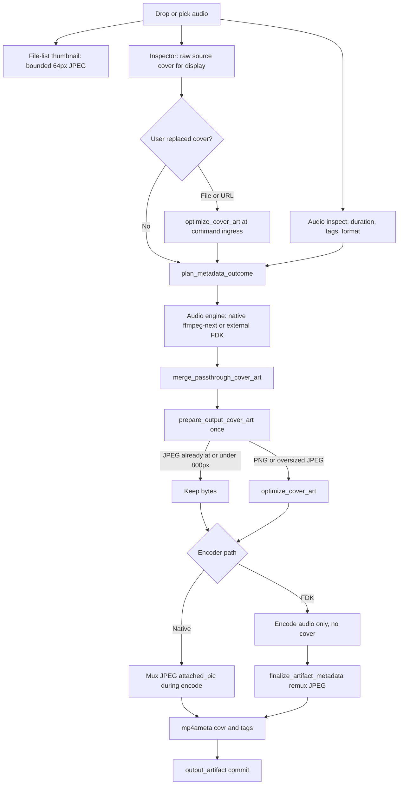

# Cover Art Processing

Read this when changing how covers are loaded, passed through, converted, or
written onto an output M4B. Ordinary tag work stays in
`src-tauri/src/metadata/AGENTS.md`.

## Write contract

Passthrough means keep a cover that already meets the write target. The target
is JPEG at or under 800px. PNG, oversized JPEG, and other decodeable images are
converted once by `optimize_cover_art` after merge. Both encoder paths then mux
and write the same JPEG.

User-picked file and URL covers are already converted at command ingress
(`load_cover_art_file`, `load_cover_art_from_url`). Source-embedded covers are
not converted at import. Conversion happens at write-prep so display reads stay
raw source truth.

## Flow

## Owners

| Step | Owner |
| --- | --- |
| File-list thumbnail | Metadata thumbnail / `mp4_covr` |
| Inspector display | Metadata read; frontend cache |
| User-picked cover ingest | Commands call `optimize_cover_art` |
| Include vs suppress after clear | `CoverArtPassthroughPolicy` |
| Write-ready bytes | `prepare_output_cover_art` after merge |
| FFmpeg attached_pic mux | Metadata `embedding.rs` |
| MP4 `covr` atom | mp4ameta |
| Final file move | `output_artifact` |

Do not convert in the FFmpeg encoder-open helper, the file-list loader, or
`CoverArtPassthroughPolicy`. That policy only answers include vs suppress.
