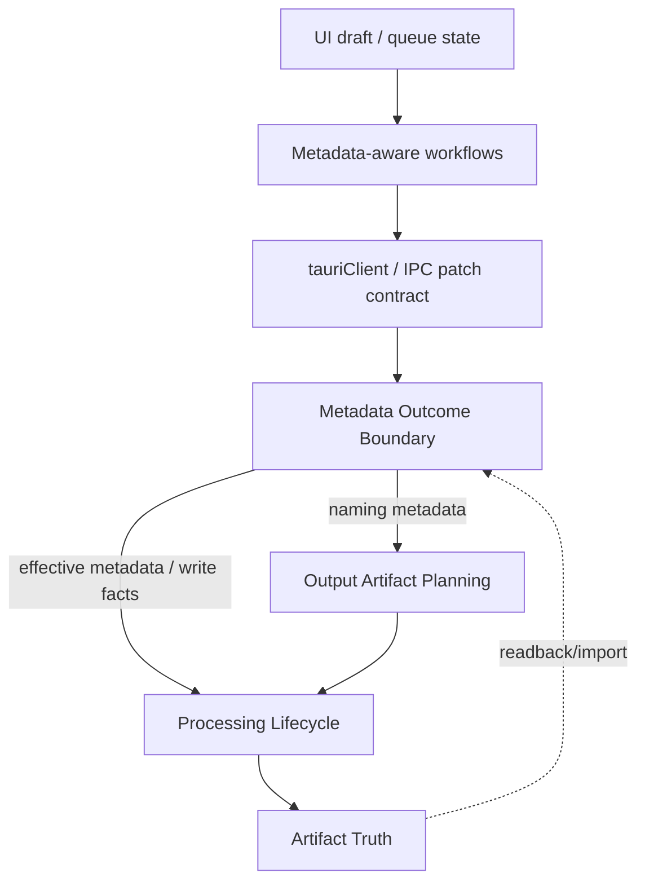

# ABB Metadata Outcome Boundary Roadmap

Date: 2026-05-19
Status: Active architecture roadmap surface; no implementation started
Source repo: `/Users/jstar/Projects/audiobook-boss`

Artifact relationship:

- This Markdown file is the editable roadmap source.
- `docs/specs/metadata-outcome-boundary-roadmap.html` is the presentation view for human review.
- Until a generator exists, update both files when roadmap content changes.

## Operating Model

This thread owns architecture/design alignment only:

- decide whether metadata deserves a roadmap,
- define the roadmap shape,
- decide which architecture, design, and behavior mutations are justified,
- keep this spec and the companion presentation current,
- produce an implementation-agent handoff prompt only when the roadmap is ready.

This thread does **not** own implementation.

Implementation will happen in a fresh Codex thread. The implementation agent
will receive a handoff prompt, create its own plan from that prompt, and work
that plan as a goal. Tests/checks should not be run continuously during this
planning thread; for implementation, verification should be concentrated near
PR readiness unless a specific design/behavior question cannot be answered
without targeted proof.

Review flow:

- JStar manages roadmap alignment, implementation oversight, and outcome
  judgment across threads.
- The implementation agent owns code changes, local verification, PR
  preparation, and review-response patches.
- GitHub PR review agents provide review feedback after the PR is opened.
- Any unexpected architecture, design, or behavior decision discovered during
  implementation routes back through this roadmap/spec before being treated as
  settled.

## Purpose / Big Picture

Metadata is a core Audiobook Boss product capability. The app is already in a
good functional place: metadata can be read, edited, queued, saved, and carried
into processing for many files. The remaining problem is architectural, not a
known broken user path.

The roadmap goal is to make metadata durable and maintainable enough that
future agents and humans can change metadata features without rediscovering
the same ownership traps.

Good looks like:

- Metadata policy has one deep owner instead of being preserved by call
  choreography.
- Every layer receives the right metadata form for its job.
- Processing, output planning, and UI workflows ask metadata questions through
  explicit surfaces instead of reconstructing metadata semantics locally.
- Glue remains only where a real technical boundary requires it.
- When the roadmap is complete, metadata architecture should stop recurring as
  a primary refactor concern; remaining metadata work should be feature work,
  compatibility evidence, or narrow bug repair.

## Problem Statement

The remaining metadata problem is that metadata policy is still partly
represented as call choreography.

In plain terms: correct behavior depends on multiple callers knowing when to
read source metadata, apply patches, sanitize for naming, preserve or clear
cover art, write tags, and hand off to output/processing. The issue is not
necessarily "too many callers" by count. The issue is that too many callers
must know metadata sequencing and policy details that should belong to a
deeper metadata outcome boundary.

This roadmap should reduce caller knowledge, not merely move code between
files.

## Scope And Constraints

In scope:

- Metadata forms across all gross layers: draft, intent patch, effective
  metadata, naming metadata, write plan, artifact/readback metadata.
- Frontend metadata state and workflows where they affect save, lookup,
  output preview, preflight, processing, and final artifact truth.
- TS↔Rust metadata contract shape through `tauriClient`, generated bindings,
  and `src-tauri/src/metadata/`.
- Backend processing/output consumers that currently assemble or interpret
  metadata policy.
- Audio processor/finalize surfaces only where metadata preservation,
  passthrough, cover art, or final tag writes are involved.

Non-goals:

- General frontend glue cleanup unrelated to metadata flow.
- A renderer/framework rewrite.
- Replacing the current TS↔Rust contract model.
- Broad audio-processing redesign outside metadata preservation/finalization.
- Reopening audiobook tag strategy without new interoperability evidence.

Constraints:

- Preserve explicit `set | clear | noop` metadata intent semantics.
- Preserve external audiobook interoperability with ABS/Plex/Apple-oriented
  tag behavior.
- Preserve path validation before metadata reads or writes on user-provided
  paths.
- Preserve artifact truth: final files, paths, tags, and terminal outcomes
  come from backend/disk truth, not UI optimism.
- Do not add generic managers, broad facades, or traits unless they remove
  real caller knowledge or isolate a real external adapter.
- Behavior changes are allowed when they are necessary to improve the metadata
  outcome boundary, but they must be deliberate roadmap decisions. A behavior
  mutation requires tracing the affected behavior through every metadata form,
  gross layer, public contract, artifact output, and user-visible consequence
  before implementation.

## Solution Posture

Chosen posture: subsystem redesign through largest coherent work blocks.

This should not be a small cleanup sequence driven by individual files. The
right unit is the metadata outcome boundary: the path from user metadata intent
to final artifact metadata. File splits such as `processing/run.rs` are
secondary effects, not the architectural destination.

The roadmap optimizes for agent/human durability. In this context,
"correctness" means correct relative to ABB's product outcomes and invariants:

- user intent to set, clear, preserve, or recompute metadata survives each
  layer,
- source metadata is hydrated and sanitized at the right point,
- naming metadata cannot accidentally become write metadata,
- write plans preserve/clear the intended tags,
- final artifacts reflect backend truth and remain interoperable.

Durability wins when the code becomes difficult to misuse because each metadata
form has a name, owner, and allowed consumer.

Behavior stability is the default posture, not a hard constraint. The roadmap
may change product behavior when the current behavior is a symptom of bad
ownership, incomplete metadata semantics, poor user outcome, or hidden
cross-layer coupling. In those cases, the behavior change must be designed as
part of the roadmap rather than treated as a side effect of refactoring.

## Behavior Mutation Protocol

Before intentionally changing metadata behavior, capture:

| Question | Required answer |
| --- | --- |
| Current behavior | What does ABB do today at the UX, command, artifact, and contract levels? |
| Target behavior | What should ABB do instead, and why is that better for the product outcome? |
| Metadata forms touched | Draft, intent patch, effective metadata, naming metadata, write plan, artifact metadata. |
| Gross layers touched | Which of L1-L6 observe, transform, or depend on the behavior? |
| Contract impact | Does TS↔Rust shape, generated bindings, public strips, or command semantics change? |
| Artifact impact | Do final files, tags, cover art, paths, or readback truth change? |
| UX impact | Does the user see a different preview, warning, save result, progress state, or error? |
| Compatibility impact | Does ABS/Plex/Apple interoperability or legacy-file handling change? |
| Rollback strategy | Can this be reverted locally, or does it require a coordinated contract/documentation reversal? |

Allowed behavior mutation examples:

- Change output naming behavior if the current behavior uses the wrong metadata
  form or lets legacy source tags poison naming.
- Change metadata save behavior if current dirty-state handling can drop a
  user clear/set intent.
- Change finalization behavior if native and external processor paths preserve
  or write metadata inconsistently.
- Change UX warning/error behavior if it makes metadata intent and artifact
  truth more honest.

Not allowed as incidental refactor fallout:

- Different final tags because a helper moved.
- Different path previews because naming metadata was replaced with raw
  effective metadata.
- Different cover-art preservation because passthrough policy was lost during
  a processor cleanup.
- Different command payload semantics without explicit TS↔Rust contract design.

## Context And Orientation

### Gross Layers

| Layer | Metadata role |
| --- | --- |
| L1 Product intent | User wants fields set, cleared, preserved, recomputed, or discovered. |
| L2 UI state | Editable drafts, dirty/pending state, queue state, cover art preview. |
| L3 Workflow coordination | Lookup, save, output review, process start, and cancellation sequencing. |
| L4 IPC contract | Explicit patch ops, normalized payloads, command/event shape. |
| L5 Backend lifecycle | Metadata planning, processing planning, job execution, write/finalize decisions. |
| L6 Artifact truth | Actual tags, paths, cover art, readback, and terminal result on disk. |

### Metadata Forms

| Form | Meaning | Desired owner | Allowed consumers |
| --- | --- | --- | --- |
| Metadata draft | What the UI currently displays or edits. | UI metadata state/form. | UI components and metadata workflows. |
| Metadata intent patch | User intent: `set`, `clear`, `noop`, `recompute`. | TS metadata intent helpers + Rust metadata contract. | `tauriClient`, metadata save, process/preflight payloads. |
| Effective metadata | Source metadata with user intent applied. | Rust metadata boundary. | Processing plan and processor execution. |
| Naming metadata | Sanitized metadata safe for output naming. | Rust metadata boundary, consumed by output artifact planning. | Output artifact path preview/plan only. |
| Write plan | Exact instruction for metadata writers. | Rust metadata boundary. | Metadata write commands and finalize paths. |
| Artifact metadata | What actually exists after write/process. | Disk/backend readback truth. | UI status, verification, future imports. |

### Current Shape

Known from current architecture mapping and source inspection:

- `src/types/metadataIntent.ts` compiles frontend metadata intent patches.
- `src/ui/metadataDraft.ts` narrows UI drafts to writable metadata fields.
- `src/ui/metadataState.ts` stores per-file metadata, pending paths, and
  intent patches.
- `src/lib/tauri/commands.ts` compiles intent patches before generated command
  calls.
- `src-tauri/src/metadata/intent.rs` owns `MetadataIntentPatch`, `PatchOp`,
  `AlbumSortPatchOp`, and `MetadataWritePlan`.
- `src-tauri/src/metadata/intent_plan.rs` owns effective metadata and naming
  metadata resolution.
- `src-tauri/src/processing/plan.rs` currently calls metadata resolution while
  building processing plans and output paths.
- `src-tauri/src/processing/run.rs` consumes planned metadata when executing
  jobs.
- Metadata save, lookup, output preview, and processing workflows all touch
  metadata at different layers.

### Current Code Trace

Frontend draft and intent:

- `src/types/metadataIntent.ts` owns frontend `MetadataIntentPatch` shape,
  actionable-patch detection, set/clear/noop compilation, date normalization,
  and draft-to-intent conversion.
- `src/ui/metadataDraft.ts` limits ordinary UI drafts to writable metadata
  fields; notably `album_sort` is not part of the generic UI draft field list.
- `src/ui/metadataState.ts` stores both current per-file metadata and
  per-file pending intent patches. `setMetadataForFile(..., { markPending:
  true })` merges intent patches so explicit clear intent can survive even
  when the merged display metadata omits the cleared key.

Frontend workflows and IPC:

- `src/ui/core/metadataSaveWorkflow.ts` filters pending metadata intent to
  currently loaded valid files and sends `MetadataSaveRequest` values to
  `tauriClient.saveMetadataBatch`.
- `src/ui/statusPanel/processingWorkflow.ts` stages dirty metadata before
  processing, builds a metadata-intent payload for merge or batch jobs, passes
  the same payload through output-plan review, and then sends it to
  `tauriClient.processAudiobookFiles`.
- `src/ui/outputPanel/outputPlanWorkflow.ts` has two metadata paths: output path
  preview sends the current metadata object to `tauriClient.previewOutputPath`,
  while processing preflight sends the explicit metadata-intent payload to
  `tauriClient.preflightProcessingPlan`.
- `src/lib/tauri/commands.ts` is the TS runtime boundary that compiles metadata
  intent maps and save requests into generated Rust binding payloads.

Backend planning and output naming:

- Metadata-only save validates the input path first, converts
  `MetadataIntentPatch` into `MetadataWritePlan`, and then calls
  `metadata::save_metadata_with_plan`.
- `src-tauri/src/metadata/intent.rs` gives processing and writing different
  interpretations of clear intent: processing clears to `None`, while write
  plans use empty values or empty cover-art bytes where writers need an
  explicit deletion instruction.
- `src-tauri/src/metadata/intent_plan.rs` currently owns effective processing
  metadata and naming metadata resolution. It reads source metadata when an
  input path is available, applies a patch when one exists, and scrubs invalid
  legacy source `series_part`/`subseries_part` values only for untouched-source
  naming.
- `src-tauri/src/processing/plan.rs` currently choreographs metadata planning:
  validate/hydrate input files, select the per-file patch, resolve effective
  metadata, infer passthrough-cover-art allowance from the patch, resolve naming
  metadata, call output path preview, and then resolve output collisions.
- `src-tauri/src/output_artifact/naming.rs` owns path rendering and strict
  naming validation, but it still receives an `AudiobookMetadata` value and
  must trust callers to provide the naming-safe form.

Processor and finalization:

- `PlannedProcessingJob` carries effective metadata plus
  `allow_passthrough_cover_art` into `processing/run.rs` and then
  `audio::processor::ResolvedProcessorAdapter`.
- The native processor path extracts passthrough chapters/cover art, applies
  the cover-art policy, fills missing cover art from passthrough, writes
  metadata during mux, then skips finalized metadata writing for non-MP4-family
  outputs because ffmpeg-next already handled it.
- The external FDK path separately extracts passthrough metadata, applies the
  same cover-art policy, merges passthrough cover art, runs external FFmpeg,
  and then remuxes with `metadata::rewrite_metadata_with_ffmpeg` to restore
  metadata, cover art, and chapters.

### Library / Contract Constraints

Source-backed planning used the `abb-library-research` route-card posture:
local repo and installed dependency truth first; external/current docs only
when a dependency-level behavior question cannot be answered from ABB's
installed versions or vendored references.

Relevant implementation constraints:

- Effect should remain a workflow-owner tool. Do not move pure metadata
  transforms or local UI field normalization into Effect just to make the
  architecture look uniform.
- Tauri runtime and generated command access remain centralized in
  `src/lib/tauri/*`. Frontend metadata callers should go through `tauriClient`
  and command specs, not generated invokers directly.
- Do not hand-edit `src/lib/generated/tauri.ts`. If Rust command or Specta
  shapes change, regenerate bindings through the repo's normal path.
- Specta/tauri-specta contract design must match ABB's installed versions:
  `specta = 2.0.0-rc.24`, `tauri-specta = 2.0.0-rc.24`, and
  `specta-typescript = 0.0.11`.
- Frontend implementation should assume Svelte 5 state modules own UI state,
  not metadata policy. Keep policy decisions in the metadata boundary or
  explicit workflow owners.
- Installed runtime versions observed during planning include
  `effect@3.21.2`, `svelte@5.55.4`, and `@tauri-apps/api@2.10.1`; if the
  implementation depends on library behavior beyond current local usage,
  refresh through `abb-library-research` before coding the dependency-facing
  shape.

### Ownership Smear To Remove

The current code has good pieces, but several rules still depend on caller
choreography:

- The metadata boundary owns effective/naming resolution, but
  `processing/plan.rs` decides when to call each helper and how to package the
  result for output planning and processor execution.
- Cover-art clear intent is detected in `processing/plan.rs`, enforced in
  `metadata::passthrough::apply_cover_art_policy`, and then re-merged in both
  native and external processor paths.
- Output naming policy is split between metadata's naming scrub and
  output-artifact's path renderer; the renderer cannot tell whether the
  `AudiobookMetadata` it receives is raw, effective, or naming-safe.
- Frontend output path preview uses a plain metadata object, while processing
  preflight uses explicit intent. That may be fine as a UX preview path, but it
  should be named and documented as a draft/naming preview path rather than
  confused with processing metadata outcome planning.

### Behavior Families To Trace First

Implementation should trace these in order before moving code:

1. **Output naming:** draft preview metadata, preflight intent metadata,
   source-read hydration, legacy `series_part`/`subseries_part` scrub, and
   output artifact collision planning.
2. **Save and clear intent:** frontend dirty state, `set | clear | noop`
   compilation, pending intent storage, metadata-only save, writer sentinel
   values, and readback truth.
3. **Cover-art policy:** custom art, explicit clear, passthrough preservation,
   preview behavior, native processor mux, and external FDK remux.
4. **Finalization passthrough:** chapter preservation, final metadata write
   decisions, native/external processor differences, output commit ownership,
   and terminal result truth.

This trace order is not a PR order. It is the pre-edit evidence order that
keeps behavior mutations deliberate instead of accidental.

## Architecture Destination

Destination principle:

> Metadata may flow through every gross layer, but metadata policy should not
> live in every gross layer.

Desired dependency shape:



The **Metadata Outcome Boundary** should answer questions like:

- What intent patch represents this user edit?
- What source metadata must be read before processing?
- What effective metadata should this job use?
- What metadata is safe for output naming?
- What write plan should a metadata-only save or final artifact commit use?
- Should cover art be passed through, cleared, replaced, or preserved?

It should not ask processing, output, or UI layers to know tag compatibility
details, sentinel clear values, legacy source sanitization, or writer strategy.

Candidate backend shape for implementation to evaluate:

```rust
pub(crate) struct MetadataOutcomeRequest<'a> {
    pub input_path: Option<&'a Path>,
    pub intent_patch: Option<&'a MetadataIntentPatch>,
    pub use_case: MetadataOutcomeUseCase,
}

pub(crate) struct MetadataOutcomePlan {
    pub effective_metadata: Option<AudiobookMetadata>,
    pub naming_metadata: Option<NamingMetadata>,
    pub allow_passthrough_cover_art: bool,
    pub write_plan: Option<MetadataWritePlan>,
}
```

This is a direction, not a committed API. The implementation agent should keep
the public strip compact and choose names that fit the final ownership better
than this sketch if source inspection points to a sharper shape.

## Plan Of Work

Default branch model:

- Use a dedicated roadmap branch: `roadmap/metadata-outcome-boundary`.
- Prefer the largest coherent PRs the roadmap can safely support. A single
  full-roadmap PR is allowed if up-front design makes the blast radius
  reviewable and the spec tracks progress tightly enough for recovery.
- Default fallback is one PR per block when a single PR would make review-agent
  findings, rollback, or local reasoning too noisy.
- Split a block only when the split preserves the block's coherent outcome and
  does not leave metadata ownership more ambiguous between PRs.
- Minimize PR/process overhead: the practical reviewers are JStar plus two
  GitHub PR review agents, so process should serve technical clarity rather
  than simulate a larger team.

### MB0: Roadmap Alignment

Status: Ready for JStar review; implementation handoff draft included.

Outcome:

- This spec and companion presentation exist.
- The roadmap optimizes for durable agent/human maintainability.
- Frontend, backend, and cross-layer metadata flow are all in scope when they
  directly affect metadata outcome truth.

### MB1: Metadata Form Taxonomy And Ownership

Goal:

- Make every important metadata form explicit in code/docs.
- Reduce vague use of "metadata" where a narrower form is intended.

Likely changes:

- Add/clarify source-level names and docs for draft, intent patch, effective
  metadata, naming metadata, write plan, and artifact/readback metadata.
- Update `docs/ubiquitous-language.md`, `docs/system-map.md`, and nested
  metadata/tauri/processing guidance only after the code shape is chosen.
- Identify public/private ownership of each form before file movement.

Done evidence:

- Future agents can classify any metadata value by form and owner.
- No roadmap PR after MB1 needs to re-litigate the basic vocabulary.

### MB2: Backend Metadata Planning Boundary

Goal:

- Deepen the Rust metadata boundary so callers request metadata plans instead
  of assembling source-read, patch-apply, naming-sanitize, cover-art policy,
  and write-plan decisions themselves.

Likely changes:

- Introduce a compact metadata planning surface inside `src-tauri/src/metadata/`.
- Keep raw helpers private where possible.
- Return typed results that separate effective metadata, naming metadata, write
  intent, and passthrough/cover decisions.

Watchpoints:

- Do not make a generic facade that merely wraps existing functions.
- Do not let output naming own metadata sanitization policy.
- Preserve validation-before-read ordering for user paths.

Done evidence:

- `processing/plan.rs` consumes a metadata planning result rather than
  reconstructing metadata semantics.
- Metadata contract tests pin public behavior, not helper existence.

### MB3: Processing And Output Metadata Consumption

Goal:

- Make processing and output planning consumers of metadata plans, not owners
  of metadata policy.

Likely changes:

- Rework `src-tauri/src/processing/plan.rs` around metadata plan inputs and
  output artifact planning.
- Keep output artifact ownership of paths, collisions, parent dirs, and commit
  truth.
- Keep processing ownership of plan/execution lifecycle.
- Make metadata-to-output naming dependencies explicit.

Watchpoints:

- `processing/run.rs` should not be split first if doing so preserves metadata
  ambiguity.
- If runner split becomes obvious during MB3, limit it to private helpers that
  reduce lifecycle density without changing public contracts.

Done evidence:

- Processing plan has fewer direct metadata policy decisions.
- Output planning receives naming-safe metadata rather than raw/effective
  metadata when naming is the only need.

### MB4: Frontend Metadata Flow Cleanup

Goal:

- Make frontend metadata draft/intent flow clear enough that agents do not
  accidentally drop explicit clear intent or bypass intended workflow owners.

Likely changes:

- Clarify the boundary between `metadataDraft`, `metadataState`,
  `metadataSaveWorkflow`, `metadataLookupWorkflow`, `outputPlanWorkflow`, and
  `processingWorkflow`.
- Remove or document direct metadata IPC calls that bypass workflow ownership
  when they affect multi-step behavior.
- Keep single-boundary UI helpers only when they are boring, local, and do not
  own metadata policy.

Watchpoints:

- Do not chase unrelated frontend glue.
- Do not require Effect for pure transforms or local UI rendering.
- Preserve efficient multi-file metadata management.

Done evidence:

- A frontend caller can tell whether it holds a draft, an intent patch, or
  stored per-file metadata.
- Save, lookup, preview, and processing paths produce the same intent payload
  semantics.

### MB5: Metadata / Audio Processor Finalization Boundary

Goal:

- Review the metadata/audio handoff where processing produces final artifacts,
  cover art is passed through or cleared, and tags are written or preserved.

Likely changes:

- Inspect native/external finalize paths only where metadata preservation,
  cover art, passthrough, or final write behavior is involved.
- Decide whether metadata finalize policy belongs in metadata, processor, or
  output artifact ownership.
- Avoid broad audio-processing redesign unless a metadata-finalization leak
  requires it.

Done evidence:

- Metadata policy at finalization has one owner.
- Native/external processor differences do not duplicate metadata commit rules
  unnecessarily.

### MB6: Closeout, Canon Docs, And Residual Debt Routing

Goal:

- Convert the roadmap's stable results into normal repo guidance and retire
  the active spec.

Likely changes:

- Update `docs/system-map.md`, `docs/ubiquitous-language.md`, nested
  `AGENTS.md`, and the Obsidian/testing-infra architecture artifacts to match
  the final state.
- Route any remaining non-blocking ideas to GitHub issues, not this spec.
- Delete this spec after implementation, review, validation, documentation
  alignment, and sync are complete.

Done evidence:

- Metadata no longer appears as unresolved architecture debt in the active
  architecture map.
- Future metadata work can start from canon docs and local owners, not chat
  memory.

## Accepted Decisions

- Metadata is the next primary architecture focus ahead of generic frontend
  glue.
- Metadata may flow through every gross layer, but metadata policy should not
  live in every gross layer.
- Use one roadmap as the active planning and implementation state holder.
- The roadmap optimizes for durable agent/human maintainability. Correctness is
  defined by ABB product outcomes and invariants, not by current code shape.
- Frontend and backend metadata flow are both in scope. The roadmap follows
  metadata outcome truth across all gross layers.
- Glue and boundaries are acceptable only when they correspond to real
  technological or ownership boundaries and cannot be removed by better
  design.
- PRs should be the largest coherent work blocks, not the smallest possible
  patches.
- Use a dedicated metadata roadmap branch. Treat one full-roadmap PR as a
  legitimate option, not an anti-pattern, if planning proves the work can stay
  coherent and reviewable.
- Prefer one PR for the full roadmap if the implementation plan, review-agent
  signal, and rollback posture remain tractable. Use fewer large PRs only when
  there is a concrete technical reason.
- Default implementation target is one PR for the full roadmap on
  `roadmap/metadata-outcome-boundary`. Split only if the full-roadmap PR would
  make review-agent feedback, rollback, or outcome reasoning materially worse.
- When this roadmap says "behavior," it means what the app does and produces at
  the product boundary: visible UX state, command outcomes, saved metadata,
  output paths, final files, tags, cover art, progress/terminal status, and
  error handling. Internal implementation shape is not behavior unless it
  changes one of those observable outcomes or a public contract.
- Behavior mutation is explicitly on the table when needed. The roadmap should
  not preserve bad behavior for compatibility with current internals, but every
  mutation must be traced through the full metadata outcome path first.
- Current metadata behavior works materially better than the old spaghetti
  shape. The roadmap is not a rescue mission; it is a consolidation pass to
  make the good outcome durable.
- Implementation belongs to a separate Codex thread after this roadmap is
  sufficiently aligned.

## Open Design Questions

These should be resolved before implementation starts:

1. Should MB1 introduce new type names only where they change code ownership,
   or also rename existing variables/functions aggressively for clarity?
2. What is the acceptable amount of temporary duplication during MB2/MB3 if it
   lets us preserve behavior while moving ownership?
3. Which metadata behavior family should be traced first: output naming,
   save/clear intent, cover-art handling, or finalization/passthrough?

Recommended defaults:

1. Rename where the name changes ownership, prevents misuse, or distinguishes a
   metadata form. Avoid broad cosmetic renames.
2. Permit temporary duplication inside a single MB block only when the duplicate
   code is deleted before the block is complete or is guarded by contract tests
   that pin the public behavior during migration.
3. Trace output naming first because it already crosses frontend preview,
   backend preflight, metadata hydration, legacy `series_part` sanitization, and
   output artifact planning. Then trace save/clear intent, then cover-art
   passthrough/finalization.

## Implementation-Agent Handoff Prompt

Use this prompt in the fresh implementation thread when JStar is ready to start
code changes:

```text
You are implementing the ABB Metadata Outcome Boundary roadmap in
/Users/jstar/Projects/audiobook-boss on branch
roadmap/metadata-outcome-boundary.

Start by reading:
- AGENTS.md
- docs/system-map.md
- docs/ubiquitous-language.md
- docs/specs/metadata-outcome-boundary-roadmap.md
- src-tauri/src/metadata/AGENTS.md
- src-tauri/src/processing/AGENTS.md
- src-tauri/src/output_artifact/AGENTS.md
- src/lib/tauri/AGENTS.md

Use the audiobook-metadata, contract-guardrails, and abb-library-research
skills. Use job-registry-and-progress only if progress/result semantics change,
and resource-lifetime-audit only if file-handle/remux/replace behavior
changes.

Goal:
Implement MB1-MB5 as one coherent PR if review and rollback remain tractable.
Split only if a smaller PR still leaves a coherent metadata outcome boundary.

Hard boundaries:
- Preserve explicit set | clear | noop intent semantics.
- Preserve path validation before source metadata reads/writes.
- Preserve artifact truth and collision-review semantics.
- Do not reopen tag strategy without new interoperability evidence.
- Do not turn metadata into a generic manager/facade.
- Do not implement unrelated frontend glue cleanup.

First design move:
Pre-validate the implementation shape before editing. Propose the compact Rust
metadata planning result that processing should consume, including effective
metadata, naming-safe metadata, write-plan/clear intent, and cover-art
passthrough policy. Then implement the smallest coherent version that removes
caller choreography from processing/output consumers.

Required trace before editing:
- Output naming from frontend preview metadata and processing preflight intent
  through Rust naming-safe metadata and output artifact planning.
- Save/clear intent from dirty UI state through pending intent patches,
  metadata-only save, writer sentinel values, and readback expectations.
- Cover-art set/clear/preserve from UI state through processing plan,
  passthrough policy, native mux, external FDK remux, and final file truth.
- Finalization passthrough boundaries for chapters, metadata writes, output
  commit, and terminal success.

Suggested implementation order:
1. MB1: introduce or clarify metadata form names only where ownership or misuse
   changes.
2. MB2: deepen src-tauri/src/metadata/ with a compact metadata outcome planning
   surface and contract tests.
3. MB3: make src-tauri/src/processing/plan.rs consume metadata plans and pass
   naming-safe metadata to output artifact planning.
4. MB4: align frontend draft/intent/preview/process naming so the UI path is
   clear about draft metadata versus intent payloads.
5. MB5: clarify native/external processor finalization ownership for cover-art
   passthrough, explicit clear, and final writes.
6. MB6 only after code review: update canon docs/nested AGENTS if the final
   shape differs from the current guidance, then remove the active spec once
   implementation, review, validation, documentation alignment, and sync are
   complete.

Verification:
Do not run broad checks continuously. Run focused tests during implementation
only when they falsify the active risk or clarify a behavior question. Before
PR readiness, run the relevant metadata/processing/output/frontend contract
tests plus scripts/check-public-api-strips.sh. Run scripts/checks.sh standard
before claiming runtime/contract behavior is ready.

Route back to JStar before proceeding if implementation requires a deliberate
behavior mutation not already covered by the roadmap's behavior mutation
protocol.
```

## Validation And Acceptance

No validation commands are run automatically in this architecture-only thread.

When implementation begins, each block should define its own proof path. Likely
proof surfaces include:

- metadata intent unit tests,
- metadata/processing/output artifact contract tests,
- workflow tests around metadata save, lookup, output preview, and processing,
- public API strip and bridge-import checks,
- full `scripts/checks.sh standard` only when implementation touches runtime,
  contract, processing, or broad behavior.

Manual acceptance should include:

- metadata save/readback for single and multi-file queues,
- processing with untouched source metadata,
- processing with partial metadata edits,
- cover-art set/clear/preserve flows,
- output naming with legacy source metadata and with explicit user edits,
- final artifact metadata inspection.

## Interfaces And Dependencies

Surfaces likely affected:

- `src/types/metadataIntent.ts`
- `src/ui/metadataDraft.ts`
- `src/ui/metadataState.ts`
- `src/ui/core/metadataSaveWorkflow*`
- `src/ui/metadataLookup/metadataLookupWorkflow*`
- `src/ui/outputPanel/outputPlanWorkflow*`
- `src/ui/statusPanel/processingWorkflow*`
- `src/lib/tauri/client.ts`
- `src/lib/tauri/commands.ts`
- `src-tauri/src/commands/metadata.rs`
- `src-tauri/src/commands/metadata/save_batch.rs`
- `src-tauri/src/metadata/`
- `src-tauri/src/processing/plan.rs`
- `src-tauri/src/processing/run.rs`
- `src-tauri/src/audio/processor/`
- `src-tauri/src/output_artifact/`

## Idempotence And Recovery

- This spec is the restart surface for the roadmap.
- If work is interrupted, resume from the latest completed MB block and update
  the Progress section before continuing.
- Do not restart from prior chat history unless this spec is clearly stale.
- If implementation discovers the roadmap shape is wrong, update this spec
  before continuing code movement.

## Progress

- 2026-05-19: Created initial active roadmap source after architecture/design
  alignment. No implementation started. No checks run by request.
- 2026-05-19: Created branch `roadmap/metadata-outcome-boundary` and locked
  the planning/implementation split. This thread remains architecture/design
  only; implementation is reserved for a future Codex thread and handoff
  prompt.
- 2026-05-19: Added source-backed flow trace, ownership-smear targets,
  recommended open-question defaults, and a fresh-thread implementation
  handoff prompt.
- 2026-05-19: Added `abb-library-research` constraints, behavior-family trace
  order, and stronger implementation-agent pre-edit trace requirements. No
  tests, checks, or browser smoke were run in this architecture-only planning
  pass by request.

## Surprises And Discoveries

- The prior Effect roadmap thread established a useful pattern: forest-first
  roadmap, Markdown source, companion HTML, and largest coherent work blocks.
- The current metadata effort should reuse that infrastructure but not inherit
  Effect's roadmap assumptions.

## Completion And Cleanup

Before deleting this spec:

- All selected MB blocks are implemented or explicitly removed from scope.
- Metadata architecture debt is no longer an active recurring concern in the
  architecture map.
- Canon docs and nested ownership guidance reflect the final design.
- Remaining ideas are routed to issues or future roadmaps.
- The repo is validated and synced according to the implementation scope.

Delete this file after the roadmap is complete; do not archive it as permanent
canon.
